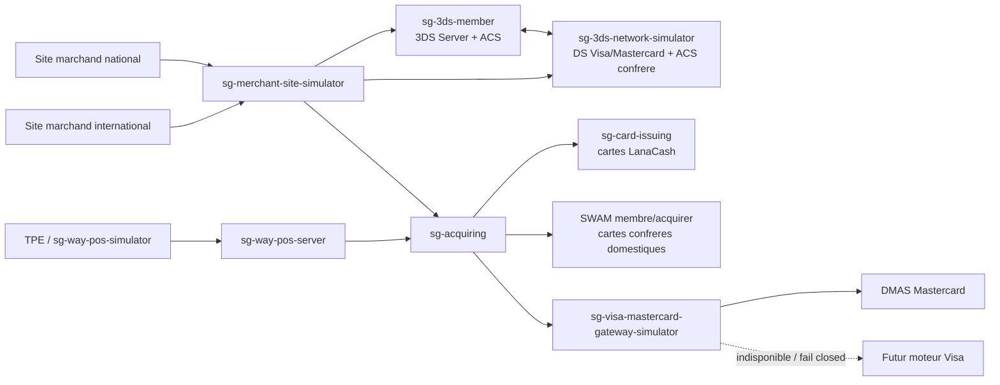
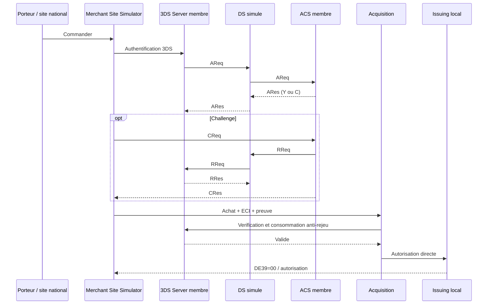
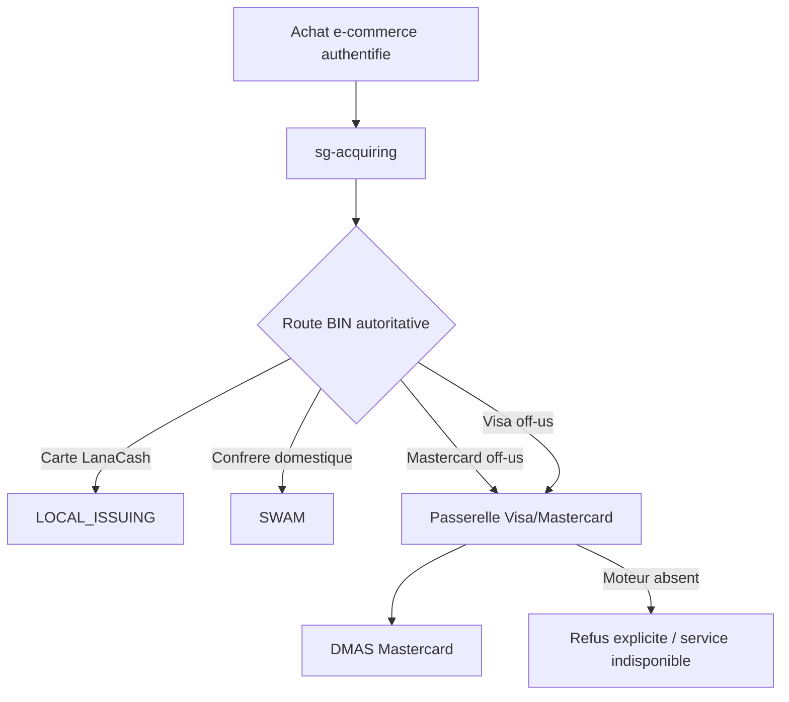

# Architecture de la plateforme monetique - version initiale

## Objectif

Cette version reunit les briques Issuing, Acquisition TPE/e-commerce, 3DS et
les simulateurs de reseaux. Elle separe strictement l'authentification du
porteur (3DS) de l'autorisation financiere (Issuing, SWAM, DMAS ou futur Visa).

Le Directory Server et les ACS externes contenus dans le depot sont des
simulateurs de recette. Ils ne sont pas des produits certifies EMVCo, Visa ou
Mastercard et ne doivent pas etre exposes comme tels en production.

## Vue d'ensemble



## Responsabilites des modules

| Module | Role | Port recette | Etat |
|---|---|---:|---|
| `sg-card-issuing` | Contrats cartes, soldes et autorisation locale | 8540 | Fonctionnel |
| `sg-acquiring` | Contrats commercants, TPE/e-commerce et routage | 8550 | Fonctionnel |
| `sg-merchant-site-simulator` | Sites national/international et orchestration achat | 8551 | Fonctionnel sandbox |
| `sg-3ds-member` | 3DS Server acquereur et ACS emetteur, separes par API | 8560 | Fonctionnel sandbox |
| `sg-3ds-network-simulator` | DS Visa/Mastercard et ACS confrere | 8561 | Simulateur uniquement |
| `sg-visa-mastercard-gateway-simulator` | Multiplexeur des reseaux financiers | 8563 | Mastercard raccorde, Visa ferme |
| `sg-way-pos-server` | Serveur TPE, terminal et commercant issus d'Acquiring | 8530 | Fonctionnel |
| DMAS | Reseau Mastercard simule et membre bancaire | 8083/8084 | Fonctionnel recette |
| SWAM | Switch domestique simule et membre bancaire | 8511/8094 | Fonctionnel recette |
| Futur Visa | Traitement financier Visa off-us | a definir | Non developpe |

## Achat e-commerce national avec carte LanaCash



Une carte emise localement ne passe ni par DMAS ni par SWAM, quel que soit son
programme Visa ou Mastercard.

## Achat international avec carte LanaCash

Le site international joue le role d'un 3DS Server etranger. Le DS simule
route l'authentification vers l'ACS LanaCash. Pour un challenge, le `RReq`
autoritatif revient au 3DS Server du site international avant l'autorisation.
La transaction financiere de la carte LanaCash reste ensuite traitee par
l'Issuing local dans le perimetre de recette.

## Cartes confreres et reseaux financiers



Le nom de programme fourni par le marchand n'est jamais utilise pour choisir
seul la route financiere : la route reste issue du routage BIN d'Acquisition.

## Securite et limites

- version de message sandbox : `2.3.1.1` ;
- preuve HMAC sandbox, cles uniquement dans un fichier local ignore par Git ;
- maximum de trois tentatives OTP ;
- `RReq` est autoritatif pour le challenge ;
- correlation sur les identifiants 3DS Server, DS et ACS ;
- preuve verifiee et consommee avant l'autorisation financiere ;
- aucun PAN, OTP ou secret complet dans les logs ou la base 3DS ;
- mode Visa financier off-us ferme tant que le vrai module Visa est absent ;
- un raccordement certifie reel exigera specifications officielles, certificats,
  gestion HSM, homologation reseau et tests de conformite.

## Recette

Le guide executable est `tests/3ds/README.md`. La commande de reference est :

```bash
bash ./tests/3ds/e2e/run-all-scenarios.sh
```
