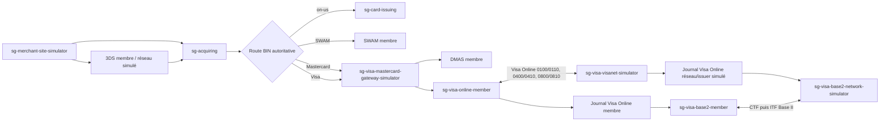
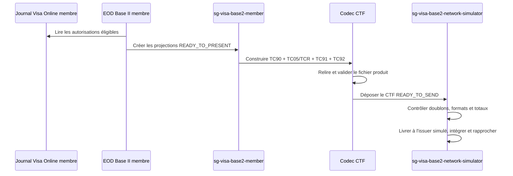
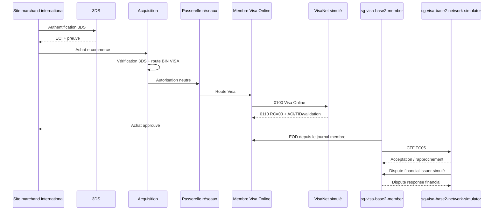

# Cadrage technique Visa Online et Visa Base II - V0.1

## 1. Statut et objectif

Ce document est un cadrage préalable au développement. Il décrit la cible
fonctionnelle et technique pour ajouter à ScenarioGenerator :

- Visa Online (anciennement Base I) dans le routage d'autorisation ;
- les achats e-commerce Visa issus du site marchand et du socle 3DS ;
- la préparation des autorisations au clearing Visa Base II ;
- le clearing, le rapprochement, le règlement et les litiges Base II ;
- un membre Visa côté banque et un simulateur VisaNet côté réseau.

Le développement ne doit commencer qu'après validation des décisions de la
section 15. Le périmètre est un banc de recette fonctionnel et traçable. Il ne
constitue pas une certification Visa.

## 2. Références analysées

| Référence | Version observée | Usage dans ce cadrage |
|---|---:|---|
| `documents/specifications/visa/visanet-authorization-only-online-messages-technical-specifications.pdf` | 15 octobre 2025 | Visa Online, messages 01xx/04xx/08xx, champs e-commerce et lien autorisation-clearing |
| `documents/specifications/visa/base-ii-clearing-interchange-formats-tc-01-to-tc-49.pdf` | 23 avril 2022 | présentations TC05, litiges, VROL, frais, règlement et conseils Base I |
| `documents/specifications/visa/base-ii-clearing-interchange-formats-tc-50-to-tc-92.pdf` | 23 avril 2022 | fichiers CTF/ITF, taux, TC90/91/92 et contrôles de lots/fichiers |

Les documents Visa restent des sources propriétaires. Ce cadrage les
paraphrase et ne remplace pas les manuels officiels.

## 3. Décisions d'architecture proposées

### 3.1 Séparation des responsabilités



Règles de propriété :

- `sg-acquiring` possède le commerçant, le profil d'acceptation, l'achat et la
  décision de route ;
- `sg-visa-mastercard-gateway-simulator` reste un multiplexeur financier et ne
  construit pas les messages Visa ;
- `sg-visa-online-member` représente la banque membre connectée à VisaNet ;
- `sg-visa-visanet-simulator` représente le réseau Visa et l'issuer externe de
  recette ;
- `sg-visa-base2-member` représente la banque membre pour le clearing ;
- `sg-visa-base2-network-simulator` représente VisaNet Base II et l'issuer
  externe de clearing dans le banc de recette ;
- les deux côtés possèdent des journaux d'autorisation indépendants ;
- Base II lit le journal de son propriétaire, mais ne modifie jamais
  l'autorisation source ;
- un fichier Base II reçu fait foi pour l'intégration clearing après tous les
  contrôles de format, de doublon et de totaux.

### 3.2 Quatre applications déployables

| Module | Nature | Responsabilité principale |
|---|---|---|
| `sg-visa-online-member` | application membre | 0100/0110, 0400/0410, 0420/0430, repeats, 0800/0810, journal côté acquéreur |
| `sg-visa-visanet-simulator` | simulateur réseau | routage VisaNet, TID/code de validation de recette, issuer externe simulé, journal indépendant |
| `sg-visa-base2-member` | application membre | EOD, TC05 outgoing, incoming, rapprochement, règlement et litiges côté membre |
| `sg-visa-base2-network-simulator` | simulateur réseau | contrôles VisaNet, retours/rejets, livraison issuer simulée, litiges et positions réseau |

Deux bibliothèques techniques complètent ces applications sans devenir des
modules déployables ni des menus :

- `sg-visa-common` : packager jPOS Visa Online, en-tête Visa, types et règles
  communes sans données métier ;
- `sg-visa-base2-common` : codec fixe CTF/ITF, TCR, TC90/91/92, validations et
  round-trip.

Les quatre applications sont configurables et lançables séparément. Elles
peuvent ensuite rejoindre les bundles membre et simulateurs du processus de
déploiement existant. Les bibliothèques communes ne contiennent ni mots de passe, ni identifiants
membre, ni valeurs Visa de recette. Elles sont versionnées séparément et
référencées par les JAR déployables.

### 3.3 Intégration au frontend global

Le portail Angular `sg-frontend` reste unique. Il n'y a pas quatre frontends
séparés. Il expose deux espaces métier membre et deux espaces de simulation :

```text
ScenarioGenerator
├── VisaNet / Visa Online Membre
│   ├── Tableau de bord et santé
│   ├── Interfaces et sessions
│   ├── Sign-on, sign-off et echo
│   ├── Autorisations et réponses
│   ├── Reversals, advices et repeats
│   ├── Journal et références réseau
│   ├── Configuration et capacités
│   └── Audit
├── Visa Base II Membre
│   ├── Tableau de bord clearing
│   ├── Journées métier et EOD
│   ├── Projections et transactions clearing
│   ├── Fichiers, lots et TCR
│   ├── Rapprochement
│   ├── Litiges et réponses
│   ├── Frais, change, règlement et comptabilisation
│   ├── Catalogues versionnés
│   └── Audit
└── Recette et simulateurs
    ├── Simulateur réseau VisaNet Online
    │   ├── Sessions réseau
    │   ├── Scénarios issuer
    │   ├── Décisions et incidents simulés
    │   └── Traces ISO masquées
    └── Simulateur réseau Visa Base II
        ├── Fichiers reçus et livrés
        ├── Contrôles, rejets et retours
        ├── Issuer clearing simulé
        ├── Litiges et états VROL simulés
        └── Positions et règlement simulés
```

Codes de navigation proposés :

| Code | Emplacement | Application cible |
|---|---|---|
| `VISA_ONLINE_MEMBER` | module métier | `sg-visa-online-member` |
| `VISA_BASE2_MEMBER` | module métier | `sg-visa-base2-member` |
| `LAB_VISA_ONLINE_NETWORK` | Recette et simulateurs | `sg-visa-visanet-simulator` |
| `LAB_VISA_BASE2_NETWORK` | Recette et simulateurs | `sg-visa-base2-network-simulator` |

Les commandes financières et les règles de simulation ne sont pas mélangées :
un utilisateur membre ne peut pas modifier une décision du simulateur réseau.
Les actions sensibles Base II (envoi de fichier, rapprochement manuel, litige,
réponse, comptabilisation et clôture) passent par le Maker/Checker transverse.

Le frontend ne reçoit jamais le PAN complet, le CAVV, un buffer ISO brut, une
clé ou un secret. Les pages réseau affichent des vues décodées et masquées, les
identifiants de corrélation, les statuts et les erreurs utiles. Les fonctions
dont le backend ou le catalogue officiel est absent restent indisponibles et
fail-closed.

## 4. Visa Online

### 4.1 Transport et format

Le codec Visa Online doit être implémenté avec jPOS :

- en-tête Visa séparé du message ISO ;
- MTI en BCD ;
- bitmaps primaire, secondaire et tertiaire si applicable ;
- numériques en BCD compacté ;
- alphanumériques en EBCDIC ;
- binaires conservés comme octets ;
- champs privés et TLV décodés par des codecs dédiés ;
- aucun dump complet contenant le PAN ou des preuves 3DS dans les logs.

Le transport de recette sera une liaison TCP persistante avec longueur de
message explicite, délais, reconnexion et corrélation. Le protocole exact de
transport et de sécurisation réel devra être fourni avec les paramètres de
raccordement Visa ; il ne sera pas inventé.

### 4.2 Cycle d'autorisation initial

Le premier périmètre couvre :

- `0100` / `0110` pour l'autorisation d'achat ;
- `0400` / `0410` pour la demande d'annulation ;
- `0420` / `0430` pour l'avis d'annulation ;
- `0101`, `0401` et `0421` pour les repeats exacts ;
- `0800` / `0810` pour sign-on, sign-off et echo.

Les repeats conservent les données de l'original. La politique initiale
respectera un délai configurable dont la valeur par défaut de recette suit la
recommandation de la spécification, et limitera le nombre de tentatives. Le
serveur devra dédupliquer un repeat en réutilisant la décision originale.

### 4.3 Corrélation Visa

Une réponse ou un message de cycle de vie ne sera jamais rapproché par un seul
champ. Le noyau de corrélation comprend :

- identifiant interne et clé d'idempotence ;
- empreinte PAN et référence sécurisée, jamais le PAN complet persistant ;
- STAN (F11), RRN (F37), TID Visa (F62.2) ;
- code d'autorisation (F38), route, montant, devise et horodatages ;
- éléments originaux requis pour les annulations.

F37 doit être unique dans la fenêtre prévue par Visa. F62.2 est généré par le
simulateur VisaNet sur la transaction originale, retourné au membre, puis
réutilisé sur les messages ultérieurs. Le montant n'est pas utilisé seul pour
rapprocher une annulation, car une annulation partielle est possible.

Le simulateur porte toujours une provenance `SIMULATED_NETWORK`. Il peut
produire des références et décisions de sandbox pour les scénarios qui le
visent explicitement. Le profil `REAL_MEMBER` n'a aucun fallback simulé : il
retourne une indisponibilité tant que le transport, les paramètres et la
réponse Visa réels ne sont pas raccordés.

### 4.4 Achat e-commerce et 3DS

Le routage existant par `pos_bin_routes` reste la source de vérité. Le site
marchand ne peut pas forcer Visa si le BIN indique une autre route.

L'adaptateur Visa doit traduire la preuve déjà vérifiée par Acquisition vers
les champs Visa applicables, notamment :

- indicateur e-commerce/MOTO et ECI ;
- ACI F62.1 ;
- XID lorsque le scénario le fournit ;
- CAVV et résultat CAVV ;
- indicateur 3DS et identifiant de transaction DS dans les champs applicables ;
- données commerçant, terminal logique, MCC, condition et mode d'entrée.

La preuve 3DS est vérifiée et consommée avant l'autorisation. Le CAVV complet
n'est pas persisté dans le journal Visa. Une empreinte, le statut, l'ECI et les
identifiants non secrets suffisent à l'audit applicatif.

### 4.5 Pont obligatoire vers Base II

La réponse `0110` doit enrichir le journal membre avec les données nécessaires
au clearing :

- ACI F62.1 ;
- TID Visa F62.2 ;
- code de validation F62.3 ;
- code d'autorisation F38 ;
- code de réponse F39 ;
- montant autorisé et devise ;
- résultats e-commerce/3DS applicables ;
- valeurs par défaut protégées par le code de validation lorsqu'un champ
  d'autorisation était absent.

Ce journal est la source de l'EOD Base II. Base II ne doit pas reconstruire ces
valeurs à partir des logs.

## 5. Journal d'autorisation Visa

Deux tables propriétaires sont proposées :

```text
visa_online_member_transaction
visa_online_network_transaction
```

Champs minimaux :

```text
id, owner, direction, interface_id,
transaction_id, correlation_id, idempotency_key,
request_mti, response_mti, operation,
pan_reference, pan_fingerprint, masked_pan,
f003_processing_code, f004_amount,
f007_transmission_datetime, f011_stan,
f012_local_time, f013_local_date, f014_expiry,
f018_mcc, f019_acquirer_country, f022_pos_entry_mode,
f025_pos_condition, f032_acquirer_id, f037_rrn,
f038_authorization_code, f039_response_code,
f041_terminal_id, f042_acceptor_id,
f043_acceptor_name_location, f049_currency,
f060_ecommerce_indicators_redacted,
f062_1_aci, f062_2_transaction_id, f062_3_validation_code,
three_ds_status, eci, ds_transaction_id,
approved, partially_approved, reversed, reversed_amount,
clearing_eligible, clearing_cycle_status,
request_at, response_at, created_at, updated_at, version
```

Ne sont jamais persistés : PAN complet, CVC/CVV2, PIN block, clés, MAC, CAVV
complet, message brut contenant des données sensibles. Une abstraction
`SensitivePaymentDataPort` devra résoudre le PAN en mémoire au moment de
packager un message Online ou Base II. Sans coffre ou source sécurisée
raccordée, la production d'un fichier réel échoue explicitement.

## 6. Visa Base II

### 6.1 Format physique initial

Le premier incrément cible le CTF :

- fichier séquentiel à enregistrements fixes ;
- TCR de 168 octets ;
- TCR0 obligatoire en premier, composants suivants ordonnés ;
- lots délimités par TC91 et fichier terminé par TC92 ;
- TC90 activable et recommandé dans le banc de recette ;
- texte en EBCDIC et numériques non compactés selon les formats ;
- contrôles de compteurs, montants, numéros de lot, fichier et doublons.

Le support ITF de 170 octets et de son hash binaire sera un incrément séparé.
Il ne doit pas être simulé par un faux CTF renommé.

### 6.2 Première présentation

Pour un achat, le noyau est `TC05/TCR0`, complété au minimum par :

- TCR1 lorsque les règles CPS/e-commerce l'exigent ;
- TCR5 pour le TID Visa, montant/devise autorisés, réponse et code de
  validation ;
- les TCR e-commerce, token ou EMV uniquement lorsque leur règle de présence
  est maîtrisée.

L'ARN Base II est un identifiant acquéreur de 23 chiffres avec format, acquéreur,
date julienne, localisateur et chiffre de contrôle. Contrairement au blocage
DMCS actuel sur DE31, la règle structurelle est présente dans Base II. Les
identifiants acquéreur et conventions locales restent toutefois des paramètres
officiels : aucune valeur arbitraire ne sera introduite.

### 6.3 Fichier et cycle EOD



L'EOD est idempotent par propriétaire, date métier et cycle. Il crée une
projection clearing immuable liée à l'autorisation, sans drapeau « fichier
généré » directement sur la transaction Online.

### 6.4 Rapprochement

Les états minimaux sont :

```text
LOCAL_ONLY
FILE_ONLY
MATCH_PROPOSED
MATCHED
MANUALLY_MATCHED
REJECTED
READY_TO_ACCOUNT
ACCOUNTED
```

La clé fonctionnelle combine ARN, TID Visa, empreinte PAN, date, montant,
devise, autorisation, acquéreur et commerçant selon disponibilité. Les écarts
restent visibles et ne provoquent pas d'écriture automatique.

### 6.5 Litiges et chargebacks

Le cycle doit être modélisé comme un dossier et une suite d'événements
immuables. Il référence la présentation clearing, pas seulement
l'autorisation.

Le noyau Base II observé comprend :

- TC15/16/17 pour les dispute financials ;
- TC05/06/07 avec usage approprié pour les dispute response financials ;
- TC35/36/37 et TC25/26/27 pour leurs reversals ;
- TCR4 pour les références VROL ;
- TC33 pour les avis d'état du litige ;
- TC52 uniquement derrière une capacité versionnée, car la spécification
  indique que son usage général est retiré ou restreint.

Les codes de raison et plusieurs statuts VROL proviennent du manuel Base II
Clearing Data Codes absent. Le moteur acceptera un catalogue versionné, mais
ne créera aucun code fictif. Les transitions qui génèrent un outgoing seront
soumises au Maker/Checker existant.

### 6.6 Règlement, frais et change

Le règlement ne se réduit pas au total d'un fichier. Il faut :

- totaliser par cycle, devise, sens, acquéreur, issuer et statut ;
- séparer clearing accepté, rejeté et clearing-only ;
- conserver les montants source et destination ;
- ingérer les taux TC56 dans un catalogue daté et versionné ;
- gérer les fee collections TC10 ;
- ingérer TC46 selon le guide VSS manquant ;
- produire des écritures équilibrées et une position nette ;
- bloquer la comptabilisation si les totaux TC91/TC92 ne concordent pas.

## 7. Modèle de données Base II proposé

Chaque application possède ses tables. Le préfixe ci-dessous devient
`visa_b2_member_` ou `visa_b2_network_sim_` :

```text
business_day
clearing_transaction
clearing_projection
file
batch
record
processing_error
reconciliation
position
ledger_entry
dispute_case
dispute_event
catalog_version
exchange_rate
```

Contraintes obligatoires :

- liens vers l'autorisation source et le fichier source ;
- unicité ARN/TID/cycle selon le type d'objet ;
- empreinte de fichier et détection de doublons ;
- verrou optimiste et transitions d'état explicites ;
- séparation stricte des schémas et droits membre/simulateur réseau ;
- outbox pour les événements intermodules ;
- audit Maker/Checker pour les actions financières sortantes.

## 8. Contrats intermodules

Le contrat neutre `RoutingTransactionRequest` est utile, mais insuffisant pour
Visa Online et le clearing. Il doit évoluer sans exposer les champs Visa à
Acquisition :

- version `1.1` rétrocompatible ;
- opération AUTHORIZATION, REVERSAL_REQUEST, REVERSAL_ADVICE et REPEAT ;
- données originales structurées ;
- attributs 3DS typés ou validés ;
- réponse enrichie par des `networkReferences` contenant le TID Visa, l'ACI et
  le code de validation ;
- aucune donnée Visa obligatoire uniquement dans une chaîne libre non validée.

Les références réseau retournées sont enregistrées par le propriétaire Visa,
puis seulement les identifiants utiles et non sensibles remontent à
Acquisition.

## 9. Sécurité et observabilité

- masquage du PAN dans toutes les réponses d'administration et tous les logs ;
- absence de PAN complet, CVC, PIN block, clés ou MAC dans les tables ;
- buffers ISO uniquement en mémoire, avec fonction de dump expurgé ;
- secrets par variables d'environnement ou coffre, jamais par valeurs par
  défaut dans `application.yml` ;
- journal d'audit des sign-on, reconnexions, repeats, EOD, imports et exports ;
- métriques sans cardinalité PAN : latence, timeouts, RC, repeats, fichiers,
  records acceptés/rejetés, écarts de rapprochement et positions ;
- fail-closed pour une route non configurée, un catalogue absent ou un champ
  normatif obligatoire inconnu.

## 10. Stratégie de tests

### 10.1 Tests de format

- golden vectors Visa Online fournis ou validés par la recette ;
- pack/unpack jPOS et comparaison champ par champ ;
- round-trip CTF 168 octets ;
- TC90/TC91/TC92, compteurs et totaux ;
- rejeu exact et déduplication ;
- fichiers tronqués, TCR désordonnés, caractères invalides et doublons.

### 10.2 Tests d'intégration

- Acquisition vers membre Visa via la passerelle ;
- membre Visa vers simulateur VisaNet ;
- `0110` enrichi avec F62.1/F62.2/F62.3 ;
- annulation liée à l'original ;
- EOD idempotent et première présentation ;
- import par le simulateur réseau/issuer et rapprochement ;
- litige, réponse et reversal avec Maker/Checker ;
- position nette équilibrée et refus si totaux incohérents.

### 10.3 E2E de référence



Un E2E n'est déclaré réussi que si les processus sont arrêtés, les journaux
des deux propriétaires concordent sur l'échange, le CTF est relu par le codec,
les totaux sont exacts et aucun secret n'apparaît dans les logs.

## 11. Ordre de développement proposé

### Incrément 0 - Socle et contrats

- créer `sg-visa-common` et les contrats versionnés ;
- packager Visa Online jPOS et en-tête Visa ;
- modèles de journaux propriétaires ;
- simulateur VisaNet minimal, sign-on/echo et tests de format.

### Incrément 1 - Autorisation e-commerce

- `sg-visa-online-member` ;
- activation de la route VISA dans la passerelle ;
- 0100/0110, journal, TID/ACI/code de validation ;
- mapping 3DS/e-commerce ;
- repeats et E2E achat approuvé/refusé/timeout.

### Incrément 2 - Cycle de vie Online

- 0400/0410, 0420/0430 et repeats ;
- annulation totale et partielle ;
- rapprochement strict avec l'original ;
- scénarios d'indétermination et reprise.

### Incrément 3 - Socle Base II

- `sg-visa-base2-common` ;
- codec CTF/TCR 168 ;
- TC90, TC91, TC92 ;
- TC05/TCR0 et TCR5 ;
- golden files et validations négatives.

### Incrément 4 - EOD et présentation

- applications `sg-visa-base2-member` et
  `sg-visa-base2-network-simulator` ;
- projections idempotentes ;
- ARN officiel/configuré ;
- outgoing, incoming et rapprochement ;
- première position de clearing équilibrée.

### Incrément 5 - Litiges

- dossiers et événements ;
- TC15/16/17, réponses et reversals ;
- TCR4/TC33 selon catalogue officiel ;
- Maker/Checker, échéances et audit.

### Incrément 6 - Settlement avancé

- taux TC56 ;
- frais TC10 ;
- TC46 après réception du guide VSS ;
- multi-devises, rapports, erreurs et ITF 170.

## 12. Critères d'acceptation du premier jalon

1. La route Visa est déterminée par `pos_bin_routes`, jamais par le marchand.
2. Une carte locale reste traitée directement par Issuing.
3. La passerelle route Visa vers le membre Visa sans fabriquer de décision.
4. Le membre et VisaNet échangent un vrai message jPOS Visa Online de recette.
5. Les deux journaux indépendants représentent le même échange.
6. La réponse conserve ACI, TID Visa et code de validation.
7. Un repeat retourne la décision originale sans double impact.
8. Une annulation référence l'autorisation originale.
9. Aucun PAN complet ou secret n'est persisté ou journalisé.
10. Les tests unitaires, d'intégration et l'E2E Git Bash passent sans processus
    résiduel.

## 13. Spécifications encore nécessaires

Les documents reçus renvoient explicitement vers d'autres références. Pour
éviter d'inventer des règles, il faudra obtenir au minimum :

- BASE II Clearing Data Codes ;
- BASE II Clearing Edit Package Messages and Reports ;
- VisaNet Settlement Service User's Guide, notamment le volume décrivant TC46 ;
- règles Visa Core et Product/Service applicables au membre et à la région ;
- règles VROL/VCRFS et catalogues de statuts/raisons ;
- paramètres de raccordement Visa Online : transport, sécurité, en-tête,
  délais, identifiants et profils de messages applicables ;
- fichiers de certification ou golden vectors Visa validés ;
- identifiants réels de membre, CIB, acquiring identifier, conventions ARN,
  calendriers et devises de règlement.

Sans ces éléments, le banc local peut tester la mécanique et des catalogues de
recette explicitement marqués, mais ne doit pas être présenté comme conforme à
la production Visa.

## 14. Écarts avec l'existant

| Domaine | Existant | Écart à traiter |
|---|---|---|
| Routage | route VISA déjà reconnue par Acquisition | downstream fermé et références Visa absentes |
| Passerelle | multiplexeur Visa/Mastercard | URL Visa sans moteur réel |
| 3DS | preuve vérifiée et anti-rejeu | mapping Visa Online détaillé à ajouter |
| Achat | STAN/RRN, RC et code autorisation | journal Visa avec TID/ACI/validation absent |
| Online | aucun codec Visa | en-tête, packager, TCP, 01xx/04xx/08xx à créer |
| Clearing | socle DMCS Mastercard seulement | Base II est un format différent et exige ses propres modules |
| ARN | DMCS volontairement bloqué | Base II décrit la structure, paramètres membre encore requis |
| Litiges | prototype DMCS | cycle Base II/VROL et catalogues Visa absents |
| Settlement | non finalisé dans DMCS | modèle Visa à développer avec VSS officiel |

Le code DMCS peut inspirer les séparations de propriétaires, l'idempotence et
les états. Son packager IPM/RDW ne doit pas être réutilisé pour Base II.

## 15. Décisions et validations avant développement

Décisions confirmées par l'utilisateur :

1. quatre applications déployables distinctes : VisaNet membre, simulateur
   réseau VisaNet, Base II membre et simulateur réseau Base II ;
2. intégration au frontend global avec deux menus métier membre et les deux
   simulateurs exclusivement dans « Recette et simulateurs ».

Décisions restantes à entériner avec le cadrage :

1. conserver les noms techniques proposés pour les quatre applications ;
2. créer les deux bibliothèques non déployables `sg-visa-common` et
   `sg-visa-base2-common` ;
3. commencer par CTF 168 octets, puis ITF 170 dans un jalon ultérieur ;
4. retenir comme premier E2E un achat e-commerce Visa authentifié, 0100/0110,
   EOD, TC05/TCR5 et intégration par le simulateur réseau Base II ;
5. maintenir bloquants les codes et identifiants Visa manquants, sauf catalogue
   de recette explicitement identifié comme simulé ;
6. traiter les litiges et le settlement avancé après le premier E2E
   autorisation-clearing.
