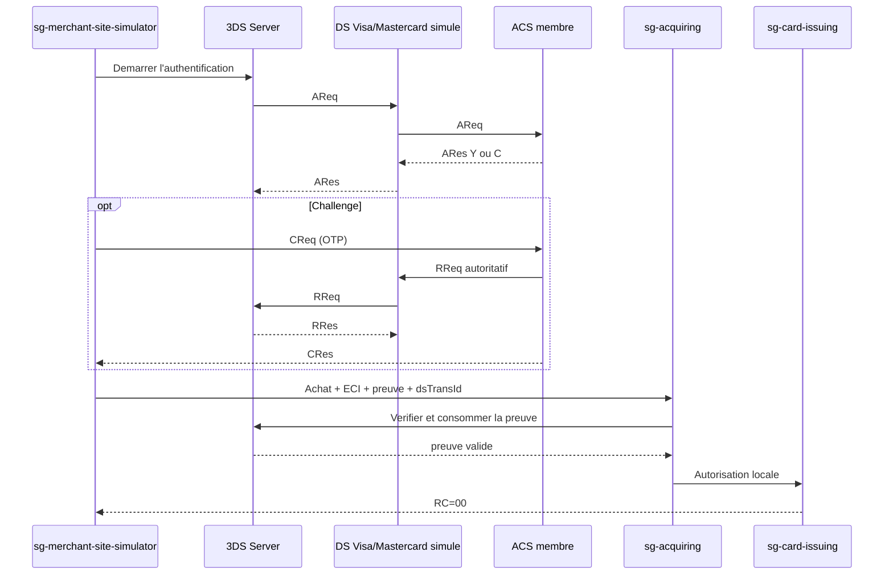

# Recette locale du module 3DS

Ce harnais valide une authentification 3DS sandbox suivie d'une vraie
autorisation dans le moteur Issuing local. Il ne revendique aucune
certification EMVCo, Visa ou Mastercard.

## Prerequis

Le fichier local ignore par Git
`runtime/issuing-connected-e2e/connected-e2e.env` doit contenir les variables
PostgreSQL/Issuing de la recette ainsi que :

```dotenv
THREE_DS_SANDBOX_HMAC_KEY=
THREE_DS_NETWORK_SANDBOX_HMAC_KEY=
THREE_DS_SANDBOX_CHALLENGE_OTP=
```

Les deux cles sandbox doivent contenir au moins 32 caracteres. Aucun de ces
secrets ne doit etre commite.

## Test complet recommande

Depuis Git Bash, a la racine du depot :

```bash
bash ./tests/3ds/e2e/run-all-scenarios.sh
```

Le script construit et migre les modules, demarre les six services, execute
les trois achats, puis arrete tous les PID qu'il a crees :

1. site national, parcours frictionless, ACS membre ;
2. site national, challenge OTP, ACS membre ;
3. site international, challenge OTP, ACS membre LanaCash.

Chaque achat doit afficher `RC=00` et `3DS=AUTHENTICATED`.

Pour reutiliser des JAR deja construits sur une machine lente :

```bash
ECOMMERCE_E2E_SKIP_BUILD=true \
ECOMMERCE_E2E_STARTUP_TIMEOUT_SECONDS=240 \
bash ./tests/3ds/e2e/run-all-scenarios.sh
```

## Scenarios unitaires

```bash
bash ./tests/3ds/e2e/run-national-frictionless.sh
bash ./tests/3ds/e2e/run-national-challenge.sh
bash ./tests/3ds/e2e/run-international-challenge.sh
```

`THREE_DS_PROGRAM=VISA` permet de tester l'authentification Visa avec une
carte LanaCash traitee localement. Une carte Visa off-us est volontairement
refusee par la passerelle tant que le moteur financier Visa n'existe pas.

## Flux verifie



Les PAN, OTP et valeurs d'authentification brutes ne sont pas persistes. La
base conserve seulement une empreinte du PAN, une empreinte de la preuve et
la date de consommation de cette preuve.
