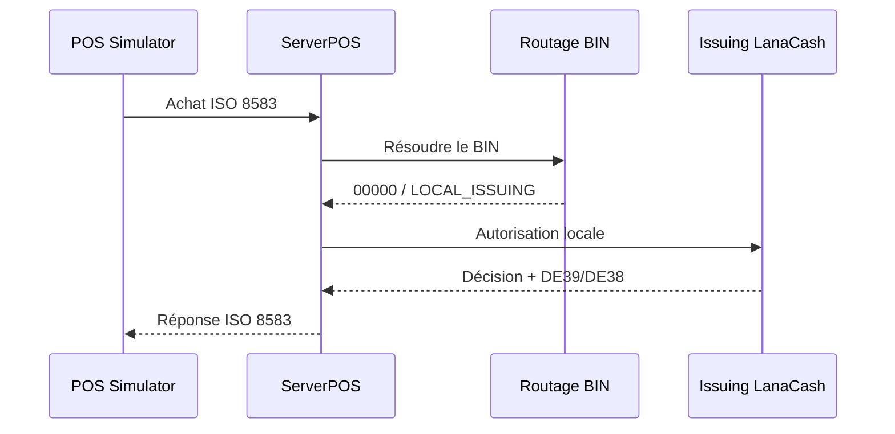
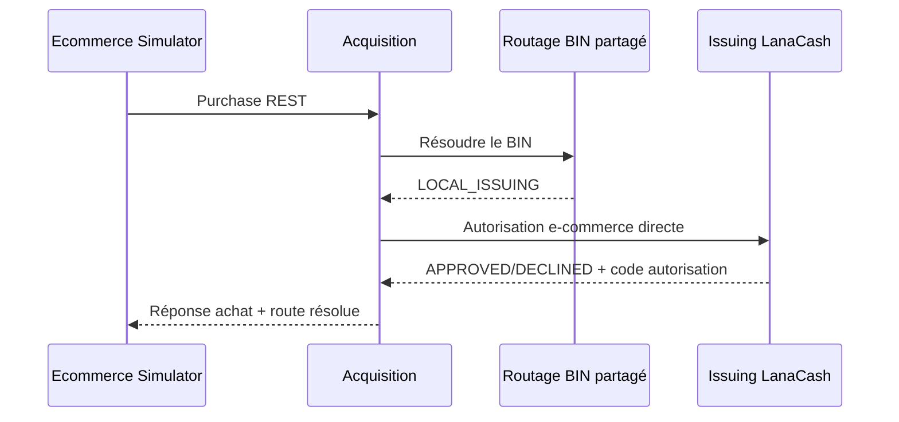
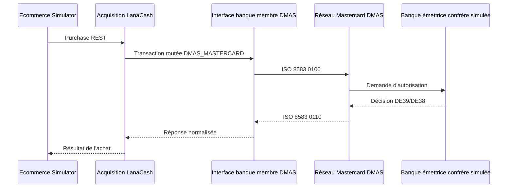
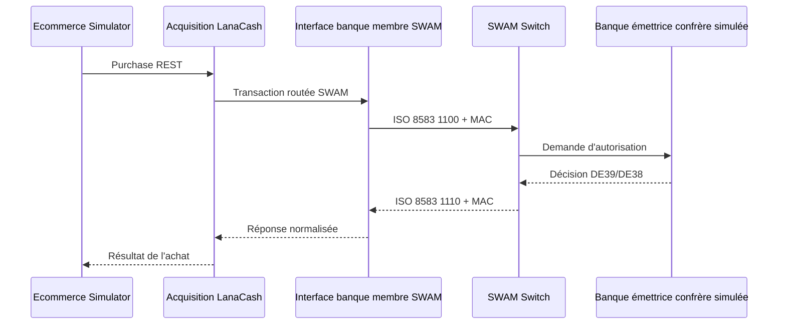

# Guide de test Acquisition TPE et e-commerce

## 1. Objet

Ce guide explique comment vérifier de bout en bout :

- un achat TPE depuis POS Simulator jusqu'à ServerPOS ;
- un achat e-commerce avec une carte émise par LanaCash, traité directement par Issuing ;
- un achat e-commerce Mastercard avec une carte confrère, transmis à DMAS ;
- un achat e-commerce domestique avec une carte confrère, transmis à SWAM.

Le module 3DS n'est pas encore raccordé. Les tests e-commerce utilisent donc
`authenticationStatus=NOT_PERFORMED` et ne transmettent ni CAVV, ni ECI, ni
identifiant de transaction 3DS.

## 2. Règle de routage commune

ServerPOS et Acquisition lisent la même table `pos_bin_routes`. Le préfixe BIN
de la carte détermine le propriétaire de la décision :

| Code d'interface | Route fonctionnelle | Propriétaire de la décision |
|---|---|---|
| `00000` | `LOCAL_ISSUING` | Issuing LanaCash |
| `DMAS_MEMBER` | `DMAS_MASTERCARD` | banque émettrice confrère via Mastercard/DMAS |
| `SWAM_MEMBER` | `SWAM` | banque émettrice confrère via SWAM |

Le client ne peut pas imposer une route qui contredit la table BIN. Une carte
LanaCash ne peut donc plus être envoyée vers DMAS ou SWAM pour obtenir une
approbation artificielle.

## 3. Schémas des parcours

### 3.1 Achat TPE avec une carte LanaCash



### 3.2 Achat e-commerce avec une carte LanaCash



Ce parcours ne démarre ni DMAS, ni SWAM.

### 3.3 Achat Mastercard avec une carte confrère



Dans le banc local, `sg-mc-dmas-member` représente l'interface de la banque
membre qui émet vers le réseau et `sg-mc-dmas-mastercard` représente le réseau.
Le mode `EXTERNAL_MEMBER_SIMULATOR` est explicite et ne sollicite jamais Issuing
LanaCash pour une carte confrère.

### 3.4 Achat SWAM avec une carte confrère



## 4. Configuration locale minimale

Le fichier utilisé automatiquement est
`runtime/issuing-connected-e2e/connected-e2e.env`. Il est ignoré par Git. Les
secrets et PAN ne doivent pas être ajoutés à un fichier versionné ni affichés
dans les logs.

Variables communes nécessaires :

```bash
DB_HOST=localhost
DB_PORT=5432
DB_NAME=scenariogenerator
DB_USER=postgres
DB_PASSWORD=...
CARD_ISSUING_DB_PASSWORD=...
ISSUING_E2E_PAN=...
ISSUING_E2E_EXPIRY=...
ISSUING_E2E_CURRENCY=504
ISSUING_E2E_BALANCE_MINOR=100000
```

Pour DMAS, ajouter une carte de test confrère qui n'appartient pas à Issuing
LanaCash :

```bash
DMAS_E2E_PAN=...
DMAS_E2E_EXPIRY=...
DMAS_ADMIN_PASSWORD=...
```

Pour SWAM, ajouter une autre carte de test confrère :

```bash
SWAM_E2E_PAN=...
SWAM_E2E_EXPIRY=...
```

Les scripts refusent de remplacer ces cartes manquantes par `ISSUING_E2E_PAN`.

## 5. Test TPE

Depuis Git Bash :

```bash
cd /d/MoneyCore/ScenarioGenerator
bash ./tests/acquiring/pos-e2e/run-all.sh
```

Exécution détaillée, utile pour observer les logs entre les étapes :

```bash
bash ./tests/acquiring/pos-e2e/00-build.sh
bash ./tests/acquiring/pos-e2e/01-start.sh
bash ./tests/acquiring/pos-e2e/02-provision.sh
bash ./tests/acquiring/pos-e2e/03-purchase.sh
bash ./tests/acquiring/pos-e2e/04-tail-logs.sh
bash ./tests/acquiring/pos-e2e/05-stop.sh
```

## 6. Test e-commerce carte LanaCash

Commande complète recommandée :

```bash
cd /d/MoneyCore/ScenarioGenerator
bash ./tests/acquiring/ecommerce-e2e/run-all.sh LOCAL_ISSUING
```

Résultat attendu :

```text
[ECOM E2E] ACHAT APPROUVE - route=LOCAL_ISSUING, RC=00, 3DS=NOT_PERFORMED
```

Ce scénario a été exécuté avec succès le 1er août 2026. Les services ont été
arrêtés automatiquement à la fin du test.

## 7. Test e-commerce Mastercard confrère

Avec `DMAS_E2E_PAN` et `DMAS_E2E_EXPIRY` renseignés dans la configuration
locale ignorée par Git :

```bash
cd /d/MoneyCore/ScenarioGenerator
bash ./tests/acquiring/ecommerce-e2e/run-all.sh DMAS_MASTERCARD
```

Résultat attendu : route `DMAS_MASTERCARD`, réponse `RC=00`, traces `0100/0110`
dans les logs du membre et du réseau DMAS.

Ce scénario a été exécuté avec succès le 1er août 2026. Le sign-on, l'échange
dynamique de PEK et la concordance des KCV ont été contrôlés avant l'achat. Le
résultat final était `DMAS_MASTERCARD`, `RC=00`, `3DS=NOT_PERFORMED`, puis tous
les services ont été arrêtés.

## 8. Test e-commerce SWAM confrère

Avec `SWAM_E2E_PAN` et `SWAM_E2E_EXPIRY` renseignés dans la configuration
locale ignorée par Git :

```bash
cd /d/MoneyCore/ScenarioGenerator
bash ./tests/acquiring/ecommerce-e2e/run-all.sh SWAM
```

Résultat attendu : route `SWAM`, réponse `RC=00`, traces `1100/1110` et contrôle
MAC réussi dans les logs membre/switch.

Ce scénario a été exécuté avec succès le 1er août 2026. Le sign-on et la
concordance des KCV des clés de session ont été contrôlés avant l'achat. Le
résultat final était `SWAM`, `RC=00`, `3DS=NOT_PERFORMED`, puis tous les
services ont été arrêtés.

## 9. Exécution étape par étape et suivi des logs e-commerce

Remplacer `LOCAL_ISSUING` par `DMAS_MASTERCARD` ou `SWAM` selon le scénario :

```bash
bash ./tests/acquiring/ecommerce-e2e/00-build-and-install.sh LOCAL_ISSUING
bash ./tests/acquiring/ecommerce-e2e/01-start.sh LOCAL_ISSUING
bash ./tests/acquiring/ecommerce-e2e/02-provision.sh LOCAL_ISSUING
bash ./tests/acquiring/ecommerce-e2e/03-purchase.sh LOCAL_ISSUING
bash ./tests/acquiring/ecommerce-e2e/04-tail-logs.sh LOCAL_ISSUING
bash ./tests/acquiring/ecommerce-e2e/05-stop.sh LOCAL_ISSUING
```

Le suivi des logs reste bloquant avec `tail -f`. Utiliser `Ctrl+C` pour quitter
le suivi, puis lancer le script d'arrêt.

## 10. Critères de réussite

- le script affiche `ACHAT APPROUVE` et `RC=00` ;
- la route retournée correspond à la route BIN résolue ;
- une carte locale ne produit aucune trace transactionnelle DMAS/SWAM ;
- une carte confrère ne produit aucune autorisation dans Issuing LanaCash ;
- le même `transactionId`, STAN et RRN est corrélable sur le parcours concerné ;
- aucun PAN complet, PIN clair, clé claire ou secret n'est journalisé ;
- le script `05-stop.sh` libère les ports démarrés par le scénario.

## 11. État de validation

| Scénario | État | Preuve actuelle |
|---|---|---|
| Tests unitaires Issuing + Acquisition + simulateur + DMAS + SWAM | Validé | 133 tests, aucun échec |
| E-commerce carte LanaCash | Validé | E2E `LOCAL_ISSUING`, `RC=00` |
| TPE | Validé antérieurement | E2E POS, `RC=00` |
| E-commerce DMAS confrère | Validé | sign-on, PEK/KCV, E2E `DMAS_MASTERCARD`, `RC=00` |
| E-commerce SWAM confrère | Validé | sign-on, KCV, E2E `SWAM`, `RC=00` |
