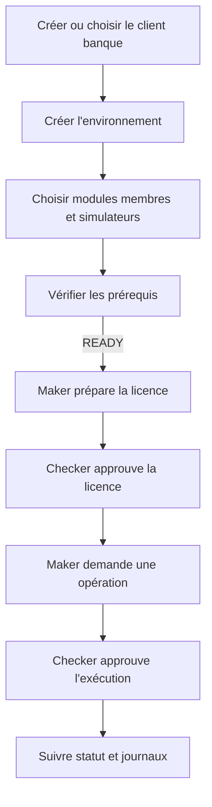

# Manuel opérateur — Menu Administration > Déploiements

## Accès et responsabilités

Le menu est visible avec `DEPLOYMENT_VIEW`. Les actions sont séparées :

- `DEPLOYMENT_PREPARE` : clients, environnements, préflight et licences ;
- `DEPLOYMENT_APPROVE` : approbation par un Checker différent du Maker ;
- `DEPLOYMENT_EXECUTE` : demande d'installation, démarrage, statut, arrêt et logs ;
- `DEPLOYMENT_ROLLBACK` : retour à une sauvegarde validée.

L'auto-approbation est refusée côté serveur. Aucun champ du menu ne permet
d'exécuter une commande shell libre.

## Parcours recommandé

### 1. Client banque

Dans `Déploiements > Clients`, renseigner le code stable, la raison sociale, le
pays et la devise. Ne pas placer de mot de passe ou de clé dans les noms.

### 2. Environnement

Dans `Déploiements > Environnements`, choisir :

- `LOCAL`, `DEV`, `TEST`, `RECETTE` ou `PREPROD` ;
- Windows ou Linux ;
- un shell compatible : Git Bash, PowerShell ou CMD sous Windows, Bash sous Linux ;
- le chemin Java 21+ et le répertoire de déploiement ;
- `NONE`, PostgreSQL ou Oracle ;
- uniquement des références de secrets, par exemple `secret://...` ;
- les chemins des bundles, de la licence signée et de sa clé publique.

Sélectionner les modules membre et simulateur réellement autorisés. Le catalogue
affiche leurs ports et variables obligatoires.

### 3. Préflight

Cliquer sur `Vérifier les prérequis`. Les statuts sont :

- `OK` : contrôle réussi ;
- `WARNING` : action possible avec justification ;
- `BLOCKING` : installation interdite.

Le rapport vérifie notamment OS/shell, Java, espace disque, répertoire, ports,
bundles, licence et base. Il ne révèle jamais la valeur d'un secret.

### 4. Licence

Le Maker choisit l'environnement, la période et la version, puis clique sur
`Préparer`. La licence reste `PENDING`. Le Checker ouvre la même page et clique
sur `Approuver`. Le serveur produit :

- `license.json.sig`, licence technique signée ;
- `license.pdf`, document lisible ne contenant aucun secret.

La clé privée de signature reste configurée sur le serveur ; elle n'est jamais
envoyée au navigateur.

### 5. Exécution

Dans `Déploiements > Exécutions`, choisir une action contrôlée : `VALIDATE`,
`PLAN`, `INSTALL`, `START`, `STATUS`, `STOP`, `UPGRADE`, `ROLLBACK` ou `LOGS`.
Le Maker soumet, puis un Checker différent approuve. Le statut et le détail
retournés par le moteur sont conservés dans l'historique.

## Incident ou rollback

1. demander `STATUS`, puis `LOGS` ;
2. demander `STOP` pour l'installation ciblée ;
3. corriger le manifeste ou les références de secrets sans exposer leur valeur ;
4. utiliser `ROLLBACK` seulement avec la permission dédiée et une sauvegarde ;
5. relancer le préflight avant tout nouveau `START`.

Le bouton d'arrêt vise uniquement le PID du bundle et ses processus enfants ;
il ne doit pas arrêter les autres modules déjà lancés sur la machine.
