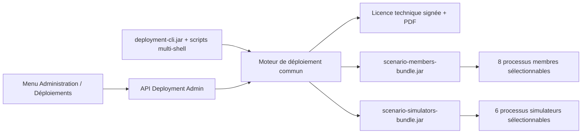

# Manuel de test — Déploiement, bundles et licences

## Objectif

Ce manuel valide sur une machine locale le même moteur utilisé par le menu
`Administration > Déploiements` et par le CLI. Le test de référence déploie le
simulateur réseau 3DS, vérifie son endpoint HTTP, consulte son état et ses
journaux, puis arrête tout l'arbre de processus.

Le test local n'utilise aucune clé, carte ou donnée de recette. La licence porte
le filigrane `TEST LOCAL - NON CONTRACTUEL`.

## Architecture testée



Chaque application Spring conserve son propre processus, son port, son PID et
son journal. Les bibliothèques sont stockées une seule fois dans chaque bundle,
et les applications métier sont embarquées sous forme de JAR minces.

## Artefacts produits

| Artefact | Contenu observé le 2 août 2026 | Taille observée |
|---|---:|---:|
| `scenario-members-bundle.jar` | 8 modules minces et 115 JAR de bibliothèques mutualisées | 94 240 646 octets |
| `scenario-simulators-bundle.jar` | 6 modules minces et 114 JAR de bibliothèques mutualisées | 93 820 394 octets |
| `deployment-cli.jar` | CLI autonome et moteur commun | 4 787 393 octets |

Les versions complètes sont embarquées dans `bundle-libraries.txt` à la racine
de chaque bundle. Cette liste est générée par Maven, triée et reconstruite avec
l'artefact. Pour la consulter avec Git Bash ou Windows `tar` :

```bash
tar -xOf ./sg-members-bundle/target/scenario-members-bundle.jar bundle-libraries.txt
tar -xOf ./sg-simulators-bundle/target/scenario-simulators-bundle.jar bundle-libraries.txt
```

Les principales familles sont Spring Boot 3.2.5 / Spring 6.1.6, Jackson 2.15.4,
jPOS 2.1.9, PostgreSQL 42.6.2, Hibernate 6.4.4, Bouncy Castle, Apache POI et les
bibliothèques internes `com.staging` en `1.0.0-SNAPSHOT`. Les inventaires sont
plus longs qu'une simple application car chaque bundle couvre plusieurs
modules. Une évolution est contrôlable en archivant le JAR livré puis en
comparant les deux `bundle-libraries.txt`.

## Prérequis

- Java 21 minimum ; le test de référence utilise le JBR Java 25 de l'IDE ;
- Maven embarqué dans `D:\MoneyCore\idea-2026.1.3.win` ;
- cache Maven `D:\MoneyCore\.m2\repository` ;
- port 8561 libre ;
- licence locale signée et clé publique présentes dans `output/pdf` ;
- aucun secret en clair dans le manifeste.

Le manifeste de référence est
`tests/deployment/config/deployment-local-windows.yml`. Son verdict attendu est
`READY`, avec un avertissement normal `DATABASE` car le module testé ne requiert
aucune base.

## Construction

Depuis la racine du dépôt :

```powershell
& 'D:\MoneyCore\idea-2026.1.3.win\plugins\maven\lib\maven3\bin\mvn.cmd' `
  -o -nsu -f pom.xml `
  -pl sg-deployment-cli,sg-members-bundle,sg-simulators-bundle -am package `
  -DskipTests '-Dmaven.repo.local=D:\MoneyCore\.m2\repository'
```

## Cycle local Git Bash

```bash
cd /d/MoneyCore/ScenarioGenerator
export DEPLOYMENT_JAVA=/d/MoneyCore/idea-2026.1.3.win/jbr/bin/java.exe
export SPRING_PROFILES_ACTIVE=connected-e2e

bash ./deployment/scripts/gitbash/deploy.sh validate \
  --manifest ./tests/deployment/config/deployment-local-windows.yml
bash ./deployment/scripts/gitbash/deploy.sh plan \
  --manifest ./tests/deployment/config/deployment-local-windows.yml
bash ./deployment/scripts/gitbash/deploy.sh install \
  --manifest ./tests/deployment/config/deployment-local-windows.yml
bash ./deployment/scripts/gitbash/deploy.sh start \
  --manifest ./tests/deployment/config/deployment-local-windows.yml
bash ./deployment/scripts/gitbash/deploy.sh status \
  --manifest ./tests/deployment/config/deployment-local-windows.yml
curl --fail http://127.0.0.1:8561/api/3ds/network/v1/health
bash ./deployment/scripts/gitbash/deploy.sh logs \
  --manifest ./tests/deployment/config/deployment-local-windows.yml \
  --bundle simulators --lines 50
bash ./deployment/scripts/gitbash/deploy.sh stop \
  --manifest ./tests/deployment/config/deployment-local-windows.yml
```

Réponse HTTP attendue : code 200, `status=UP`, module
`sg-3ds-network-simulator`, programmes `VISA` et `MASTERCARD`.

## Contrôles de fin

- `status` indique le PID du bundle pendant l'exécution ;
- `logs` affiche le démarrage en UTF-8 ;
- `stop` arrête le bundle et ses descendants ;
- le port 8561 n'écoute plus ;
- aucune valeur de secret n'apparaît dans la licence, le manifeste ou les logs.

## Résultats de référence du 2 août 2026

- construction des 22 projets nécessaires aux CLI et bundles : succès ;
- non-régression Maven finale : 75 tests (69 communs, 5 Deployment et 1
  simulateur réseau 3DS), 0 échec, 0 erreur ;
- validation locale : `READY`, 10 contrôles OK, 1 avertissement DB `NONE` ;
- endpoint réseau 3DS : HTTP 200 ;
- commandes `status`, `logs` et `stop` : succès ;
- arrêt complet : PIDs du bundle et du module absents, port 8561 libéré ;
- Playwright Deployment : 2 scénarios réussis.

## Limites avant recette

Le script Bash Linux est validé statiquement sur Windows, mais doit être exécuté
sur un véritable hôte Linux. Le déploiement en recette attend encore les chemins,
ports, base PostgreSQL ou Oracle et références de secrets propres à la banque.
Ces valeurs ne doivent jamais être remplacées par des données fictives.
