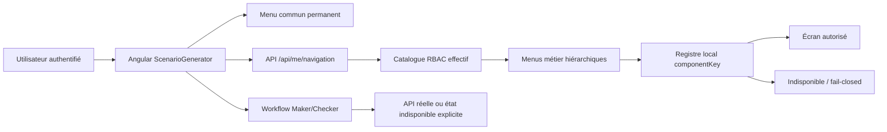
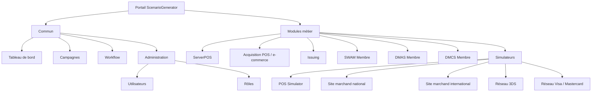

# Manuel de test du frontend global ScenarioGenerator

## 1. Objet

Ce manuel explique comment vérifier le portail Angular global, ses menus
communs, ses modules métier, le RBAC, les rôles et la fondation Maker/Checker.
Il complète le guide d'acquisition TPE/e-commerce sans simuler une opération
métier ni une validation qui n'existe pas dans les backends.

## 2. Périmètre

Le test couvre :

- le menu commun permanent : tableau de bord, campagnes, workflow,
  administration et aide ;
- les modules ServerPOS, Acquisition POS/e-commerce, Issuing, SWAM Membre,
  DMAS Membre et DMCS Membre ;
- le menu dédié aux simulateurs ;
- la séparation Utilisateurs/Rôles ;
- la protection des routes dynamiques par la navigation RBAC ;
- le comportement fermé du Maker/Checker tant que ses API ne sont pas
  raccordées ;
- l'absence de PAN, PIN et clé de test codés en dur dans le bundle Angular.

Le catalogue est installé par `sql/19_frontend_global_catalog.sql`, après la
migration `sql/18_portal_rbac_workflow.sql`.

## 3. Architecture vérifiée



## 4. Organisation attendue des menus



Le site marchand national ou international ne doit jamais apparaître dans le
menu Acquisition. Il appartient uniquement à `LAB_SIMULATORS`.

## 5. Prérequis

- Node.js et les dépendances de `sg-frontend/node_modules` installés ;
- navigateur Chromium Playwright installé ;
- Git Bash ;
- pour le test connecté : migrations SQL 18 puis 19 appliquées, frontend et
  orchestrateur démarrés, compte réel disposant des permissions nécessaires.

Aucun identifiant ni mot de passe n'est versionné. Les tests connectés exigent
des variables d'environnement explicites.

## 6. Test contractuel autonome recommandé

Depuis Git Bash :

```bash
cd /d/MoneyCore/ScenarioGenerator
bash ./tests/frontend/gitbash/run-all.sh
```

Le script :

1. compile Angular en mode production ;
2. démarre un serveur statique isolé sur `127.0.0.1:4217` ;
3. exécute `frontend-global-shell.spec.ts` ;
4. arrête le serveur de test, y compris en cas d'échec.

Résultat attendu :

```text
3 passed
```

Les trois contrôles sont :

- coexistence du menu commun et des menus métier, avec les sites marchands
  exclusivement sous Simulateurs ;
- affichage des rôles et permissions retournés par l'API mockée ;
- absence de fausse validation lorsque les API Maker/Checker sont absentes.

## 7. Test connecté avec les backends réels

Démarrer d'abord la base, l'orchestrateur et le frontend, puis exporter les
variables uniquement dans la session Git Bash :

```bash
export E2E_BASE_URL=http://127.0.0.1:4200
export E2E_LOGIN='...'
export E2E_PASSWORD='...'

bash ./tests/frontend/gitbash/run-connected-playwright.sh
```

Le test connecté n'a aucune valeur de secours pour le mot de passe. S'il manque
une variable, le script s'arrête avant d'ouvrir le navigateur.

## 8. Contrôles manuels complémentaires

Avec un profil administrateur :

1. vérifier que le menu commun reste visible après la sélection de chaque
   module ;
2. ouvrir Administration > Utilisateurs puis Administration > Rôles ;
3. vérifier que les permissions sont visibles sans exposer de secrets ;
4. sélectionner Acquisition et confirmer l'absence des sites marchands ;
5. sélectionner Simulateurs et confirmer la présence des sites marchands
   national et international ;
6. saisir directement l'URL d'un écran non accordé et vérifier la redirection
   vers `/forbidden` ;
7. ouvrir Mes validations sans API workflow et vérifier le message explicite,
   sans ligne d'approbation fictive ;
8. tester les langues FR, EN et ES.

Avec un profil sans `ROLE_MANAGE`, le lien Rôles et la route correspondante
doivent être inaccessibles. La même règle s'applique à `USER_MANAGE` pour les
Utilisateurs.

## 9. Critères de réussite

- le build Angular se termine sans erreur ;
- les trois tests Playwright contractuels passent ;
- le menu commun est toujours présent ;
- chaque module possède son propre menu hiérarchique ;
- les sites marchands sont uniquement sous Simulateurs ;
- une route non accordée est refusée ;
- une `componentKey` inconnue affiche un écran indisponible ;
- aucun secret de test n'est présent dans le bundle ;
- l'absence des API Maker/Checker ne produit aucun faux succès ;
- aucun serveur de test ne reste actif après le script.

## 10. État de validation au 2 août 2026

| Validation | Résultat |
|---|---|
| Build Angular production | Réussi |
| Playwright contractuel | 3 tests, 3 réussis |
| Compilation orchestrateur et API Rôles | Réussie |
| Non-régression `sg-common` | 69 tests, aucun échec |
| Test connecté au catalogue SQL 19 | À exécuter après application des migrations et démarrage de la recette |
| API Maker/Checker complète | Non implémentée ; interface volontairement fermée |
