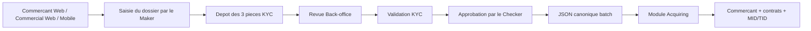

# Guide utilisateur et Proof of Test - Affiliation commercant 3 canaux

Date de recette : 7 aout 2026

Branche : `codex/AddingFrontendMerchantPortal`

## 1. Verdict

**RECETTE INTEGREE REUSSIE POUR LES TROIS CANAUX**

Les parcours Commercant Web, Commercial Web et Application Mobile ont chacun
ete executes avec des acteurs distincts, un controle KYC, une soumission par
un Maker, une validation par un Checker, la generation du JSON canonique et
son traitement reel par le module Acquiring.



## 2. Resultats certifies

| Canal | Maker | Checker | Dossier | KYC | Statut final | MID | TID |
|---|---|---|---|---|---|---|---|
| Commercant Web | `merchant.merchant-web.743d4abe` | `checker.validator` | `ONB-29CBB112` | `VALIDATED` | `PROVISIONED` | `100000000000004` | `10000002` |
| Commercial Web | `commercial.commercial-web.6dd2da69` | `checker.validator` | `ONB-405A108D` | `VALIDATED` | `PROVISIONED` | `100000000000005` | `10000003`, `10000004` |
| Application Mobile | `merchant.mobile.30ea25c0` | `checker.validator` | `ONB-38832F25` | `VALIDATED` | `PROVISIONED` | `100000000000006` | `10000005`, `10000006`, `10000007` |

Dans les trois cas, le job de provisionnement est `SUCCEEDED`. Le Maker et le
Checker sont differents et sont recopies dans le JSON transmis a Acquiring.

## 3. Guide operateur commun

### Etape 1 - Creer le prospect

Le Commercial saisit :

1. l'identifiant du futur commercant ;
2. son adresse e-mail ;
3. l'acquereur de rattachement.

Le compte est cree sans mot de passe choisi par le Commercial. En exploitation,
le commercant active lui-meme son compte depuis son invitation.

### Etape 2 - Completer le dossier en tant que Maker

Le Maker depend du canal :

- Commercant Web : le commercant complete son propre dossier ;
- Commercial Web : le commercial complete le dossier accompagne ;
- Mobile : le commercant complete le meme dossier depuis l'application.

Les donnees de recette comprennent la raison sociale, le nom commercial,
l'immatriculation, le pays, le MCC, le compte de reglement, la devise, le
produit Acquiring, le canal d'acceptation, le point de vente et le nombre de
terminaux demandes.

### Etape 3 - Deposer les pieces KYC

Trois references documentaires opaques sont obligatoires :

1. existence legale ;
2. identite du representant ;
3. justificatif du compte bancaire.

Le JSON metier ne contient aucun document en Base64. Il contient uniquement
une reference de stockage, le type MIME, la taille et l'empreinte SHA-256.

### Etape 4 - Controle Back-office

L'acteur `backoffice.reviewer` accepte les trois pieces, puis positionne le KYC
a `VALIDATED`. Il ne peut pas remplacer le Maker ni le Checker.

### Etape 5 - Soumettre et approuver

Le Maker soumet le dossier. Une demande apparait dans la file Checker. L'acteur
`checker.validator`, different du Maker, approuve le dossier. Le statut passe
a `APPROVED`.

### Etape 6 - Generer le JSON canonique

Le dossier approuve est place en file batch. Le backend serialise le contrat
canonique et le conserve avec une cle d'idempotence
`merchant-onboarding:{caseId}`.

Fichiers exacts de la recette :

- [Commercant Web](evidence/three-channels/merchant-web-canonical-acquiring.json) ;
- [Commercial Web](evidence/three-channels/commercial-web-canonical-acquiring.json) ;
- [Application Mobile](evidence/three-channels/mobile-canonical-acquiring.json).

Chaque fichier contient notamment : identifiant et reference du dossier,
acquereur, commercant, MCC, produit, point de vente, nombre de terminaux,
Maker et Checker.

### Etape 7 - Integrer dans Acquiring

Le batch transmet exactement le JSON stocke a l'endpoint interne Acquiring.
Acquiring realise dans une transaction :

1. la creation du commercant ;
2. l'approbation du commercant ;
3. la creation du point de vente ;
4. la creation et l'approbation du contrat commercant ;
5. l'attribution du MID ;
6. la creation des contrats TPE et l'attribution des TID ;
7. la sauvegarde du recu idempotent et de l'empreinte du payload.

## 4. Preuves techniques

### 4.1 Harnais reproductible

Le test est automatise par :

`tests/merchant-onboarding/run-three-channel-e2e.ps1`

Exemple d'execution sans placer le mot de passe dans la ligne de commande :

```powershell
$env:MERCHANT_E2E_DB_PASSWORD='<mot-de-passe-de-recette>'
$env:MERCHANT_E2E_JWT_SECRET='<secret-jwt-de-recette>'
powershell.exe -NoProfile -ExecutionPolicy Bypass -File `
  tests/merchant-onboarding/run-three-channel-e2e.ps1
Remove-Item Env:MERCHANT_E2E_DB_PASSWORD, Env:MERCHANT_E2E_JWT_SECRET
```

Resultat final observe :

```text
THREE_CHANNEL_E2E_OK
```

### 4.2 Resultats structures

- [Synthese des trois canaux](evidence/three-channels/summary.json) ;
- [Resultat Commercant Web](evidence/three-channels/merchant-web-result.json) ;
- [Resultat Commercial Web](evidence/three-channels/commercial-web-result.json) ;
- [Resultat Mobile](evidence/three-channels/mobile-result.json).

### 4.3 Preuve Acquiring PostgreSQL

Trois recus existent dans `acquiring_onboarding_receipt` avec les cles :

- `merchant-onboarding:29cbb112-8def-4044-b5ce-5646136b32a4` ;
- `merchant-onboarding:405a108d-b331-4b6c-b440-3a768eb76909` ;
- `merchant-onboarding:38832f25-14d5-424c-a916-92f981361acf`.

Les recus portent chacun une empreinte SHA-256 du payload et le resultat JSON
persistant avec le Merchant ID, le MID et les TID. Aucun MID/TID n'est invente
par le portail ou par le module Onboarding.

## 5. Distinction des niveaux de test

Cette recette est un **E2E backend integre reel** : PostgreSQL, Merchant
Onboarding et Acquiring ont ete utilises. Les trois canaux sont representes par
leurs acteurs et leurs contrats API reels.

Elle ne constitue pas encore un clic-a-clic complet dans les IHM pour les
etapes dossier/KYC/Checker : le premier increment frontend expose actuellement
l'activation, la connexion, la creation du prospect, le tableau de bord et la
lecture du dossier. Les ecrans de saisie KYC complets restent le prochain
increment.

## 6. Limite de securite observee

L'endpoint interne Acquiring est actuellement protege par la securite Spring
automatique, mais l'adaptateur Onboarding ne lui transmet pas encore de jeton
interservices. Le harnais sandbox desactive uniquement cette auto-configuration
sur l'instance temporaire Acquiring. Aucun service utilisateur n'est modifie.

Avant production, il faut mettre en place une authentification service-a-service
(mTLS ou OAuth2 client credentials) entre Merchant Onboarding et Acquiring.
Ce point est une condition de mise en production, pas un echec du parcours
metier teste.

La non-regression Maven finale du perimetre backend confirme `BUILD SUCCESS` :
**107 tests, 0 echec, 0 erreur, 0 ignore**.

## 7. Processus et donnees apres recette

Les instances temporaires sur `8550` et `8570` ont ete arretees par le harnais.
Les dossiers, jobs, commercants, contrats, MID, TID et recus de cette preuve
restent volontairement dans la base locale de recette pour audit.

Les iterations de mise au point ont egalement laisse des dossiers techniques
hors preuve, notamment l'essai qui a revele le refus HTTP 401 entre les deux
services. Ils n'ont pas ete supprimes afin de conserver l'audit. Seules les
trois references `ONB-29CBB112`, `ONB-405A108D` et `ONB-38832F25` constituent
le jeu d'acceptation de ce document.
