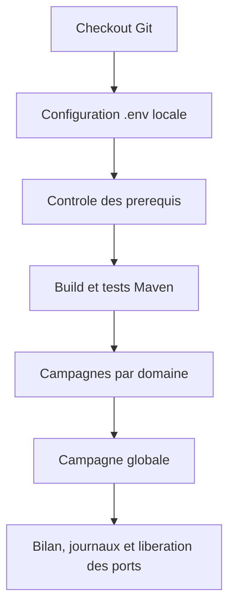

# Livraison et execution des campagnes sur la machine RECETTE

## But du document

Ce manuel permet a une equipe technique de livrer le depot, preparer la
configuration locale et executer les campagnes Git Bash par module ou en
integration globale. Il s'applique au sandbox de recette et ne constitue pas
une procedure de mise en production.

## Contenu livre

- les scripts communs sous `tests/platform-e2e/common/` ;
- un repertoire et un guide pour Issuing, Acquisition, 3DS, DMAS/DMCS, SWAM
  et Visa ;
- le lanceur global `tests/platform-e2e/global/run-all.sh` ;
- le modele sans secret `tests/platform-e2e/platform-e2e.env.example` ;
- ce manuel de livraison.

Les PDF reseau confidentiels, fichiers LMK, ZMK protegee, composantes claires,
PAN/PIN de recette et mots de passe ne font pas partie du commit Git. Ils sont
remis par le canal securise de la recette et places uniquement dans les
emplacements locaux autorises.

## Architecture de la campagne



## 1. Prerequis de la machine

Verifier avant la livraison :

- Windows avec Git Bash ;
- Java 21 ;
- PostgreSQL accessible et base `scenariogenerator` creee ;
- Maven embarque ou chemin `MAVEN` configure ;
- client PostgreSQL `psql` ;
- `curl`, `python` et `bash` disponibles dans Git Bash ;
- droits d'ecriture sur `runtime/` et `logs/` ;
- ports des modules disponibles.

Exemples de controles depuis Git Bash :

```bash
java -version
bash --version
curl --version
python --version
psql --version
git status --short --branch
```

## 2. Livraison du code

Depuis le repertoire cible :

```bash
git fetch origin
git checkout codex/AddingVisaOnlineAndClearing
git pull --ff-only origin codex/AddingVisaOnlineAndClearing
```

Conserver le hash du commit livre dans le proces-verbal de recette :

```bash
git rev-parse HEAD
git status --short
```

Le worktree doit etre propre avant de commencer, a l'exception des fichiers
locaux ignores sous `runtime/`, des LMK et des specifications confidentielles.

## 3. Configuration locale

Creer la copie non versionnee :

```bash
mkdir -p runtime/platform-e2e
cp tests/platform-e2e/platform-e2e.env.example \
  runtime/platform-e2e/platform-e2e.env
```

Editer `runtime/platform-e2e/platform-e2e.env` manuellement. Le chargeur lit
les configurations dans cet ordre :

1. `runtime/issuing-connected-e2e/connected-e2e.env` si deja present ;
2. `runtime/platform-e2e/platform-e2e.env` ;
3. `runtime/platform-e2e/<domaine>.env` pour une surcharge facultative.

Les informations communes a renseigner sont notamment :

- acces PostgreSQL : `DB_HOST`, `DB_PORT`, `DB_NAME`, `DB_USER`,
  `DB_PASSWORD` et mots de passe des schemas proprietaires ;
- Issuing/WayPos : fichiers LMK, pepper PAN, cle outbox, cles TAK/TAMK/TPMK,
  carte de recette, expiration, devise et solde ;
- 3DS : cles HMAC sandbox, OTP challenge et programme carte ;
- DMAS : mot de passe admin, KEK, MDK, PIN et carte de test ;
- SWAM : KEK/ZMK de test et KCV ;
- Visa : chemin du jeu de cles confidentiel et variables du profil
  cryptographique lorsqu'il est active.

Ne jamais executer `source runtime/platform-e2e/platform-e2e.env` avec
`set -x`, ni joindre ce fichier a un ticket ou a un journal.

## 4. Controle des cles de test

Les valeurs claires sont remises separement et restent dans le `.env` local.
Avant la campagne, comparer uniquement les KCV ou references suivantes :

| Domaine | Materiel de test | Controle attendu |
|---|---|---|
| WayPos | TAMK / TPMK triple longueur | KCV `51C71D` / `95B446` |
| DMAS | KEK / MDK de LAB | KCV `2D617C` / `944A44` |
| SWAM | ZMK de la ceremonie de test | KCV `F6EE59` |
| Visa | jeu CEMEA VIP/VCMS double longueur | Encryption BIN `434179`, document confidentiel autorise |

Le fichier local `ZMK SWAM.txt` conserve la representation protegee sous LMK
et son KCV. Le profil bootstrap actuellement teste consomme
`SWAM_E2E_KEK_CLEAR`, injectee seulement dans l'environnement de la campagne.

Le sandbox Visa Online/Base II courant valide l'autorisation, l'idempotence
et le clearing sans consommer encore les cles cryptographiques Visa. Leur
presence dans le `.env` de livraison prepare les profils unitaires/globaux qui
activeront ce raccordement ; elle ne doit pas etre presentee comme une preuve
de transport Visa certifie.

## 5. Premier lancement avec build

Le premier lancement sur une nouvelle livraison doit conserver le build :

```bash
bash tests/platform-e2e/global/run-all.sh
```

Le lanceur verifie les prerequis, construit les modules requis, execute les
tests Maven, demarre et provisionne chaque domaine, lance les scenarios puis
arrete les services.

Pour valider un domaine avant la campagne globale :

```bash
bash tests/platform-e2e/issuing/run-all.sh
bash tests/platform-e2e/acquiring/run-all.sh
bash tests/platform-e2e/three-ds/run-all.sh
bash tests/platform-e2e/mastercard-dmas-dmcs/run-all.sh
bash tests/platform-e2e/swam/run-all.sh
bash tests/platform-e2e/visa/run-all.sh
```

## 6. Reexecution avec les JAR deja valides

Une fois le build de la livraison accepte :

```bash
PLATFORM_E2E_SKIP_BUILD=true \
  bash tests/platform-e2e/global/run-all.sh
```

Cette option ne doit pas etre utilisee apres une modification de code, de
dependance ou de version. Dans ce cas, relancer sans `PLATFORM_E2E_SKIP_BUILD`.

Pour continuer apres un echec et obtenir un bilan complet :

```bash
PLATFORM_E2E_CONTINUE_ON_FAILURE=true \
  bash tests/platform-e2e/global/run-all.sh
```

## 7. Resultat attendu

Le fichier `runtime/platform-e2e/global/summary.tsv` doit contenir exactement
les domaines selectionnes avec le statut `PASSED`. Pour la campagne complete :

```text
issuing                 PASSED
acquiring               PASSED
three-ds                PASSED
mastercard-dmas-dmcs    PASSED
swam                    PASSED
visa                    PASSED
```

Conserver dans le dossier de preuve de recette :

- le hash Git livre ;
- `runtime/platform-e2e/global/summary.tsv` ;
- les fichiers `status.tsv` des domaines ;
- les journaux `global/<domaine>.log` et `.err.log` ;
- les resultats metier des domaines ;
- la date, l'operateur et l'identifiant de la machine.

Ne pas archiver le `.env`, les LMK, les cles ou les PAN/PIN avec les preuves.

## 8. Consultation et arret

Pour suivre un domaine dans un terminal separe :

```bash
bash tests/platform-e2e/<domaine>/06-tail-logs.sh
```

Pour arreter un domaine :

```bash
bash tests/platform-e2e/<domaine>/07-stop.sh
```

Pour demander l'arret de tous les domaines de la campagne :

```bash
bash tests/platform-e2e/global/07-stop.sh
```

Les scripts n'arretent que les PID qu'ils ont enregistres. Si un port reste
occupe par un processus externe, identifier son proprietaire avant toute
action ; ne jamais tuer un PID par supposition.

## 9. Diagnostic rapide

| Symptome | Verification |
|---|---|
| variable requise absente | completer le `.env` local, sans modifier le modele versionne |
| KCV different | arreter la campagne et refaire la remise de cle de LAB |
| `already launched` ou port occupe | executer le `07-stop.sh` du domaine puis identifier le PID externe |
| build Maven en echec hors ligne | verifier le cache Maven ou autoriser le telechargement controle |
| service annonce UP puis indisponible | lire le journal console et le journal applicatif du domaine |
| statut `FAILED` global | ouvrir d'abord `<domaine>.err.log`, puis `status.tsv` |
| clearing vide | verifier que les autorisations/advice eligibles ont ete crees le meme business date |

Un echec faute de secret, de vecteur officiel ou de service externe est un
echec de recette explicite. Il ne doit jamais etre remplace par une carte, une
cle, un ARN ou une reponse d'approbation fictive.

## 10. Limites connues a consigner

- WayPos reel attend toujours les vecteurs PIN/ARQC officiels de recette ;
- DE31/ARN DMCS reel reste bloque par la specification manquante ;
- SWAM sandbox ne certifie pas le MAC avec le switch SWAM reel ;
- Visa sandbox ne certifie pas le transport/HSM, VROL ou tout le clearing
  bilatéral Visa.

Ces limites ne remettent pas en cause le resultat sandbox, mais doivent rester
visibles dans le proces-verbal de livraison.
