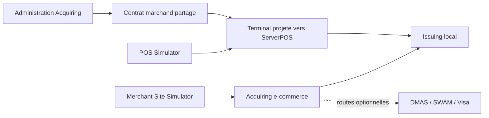

# Test E2E Acquisition TPE et e-commerce

## Objectif

Valider que le marchand, le contrat et le terminal sont administres par
Acquiring, projetes vers ServerPOS, puis utilises par les deux simulateurs.



## Deux executions principales

Le `run-all.sh` execute sequentiellement un achat TPE puis un achat e-commerce
local, avec arret entre les deux :

```bash
bash tests/platform-e2e/acquiring/run-all.sh
```

Pour utiliser les scripts numerotes sur un seul canal :

```bash
ACQUIRING_TEST_CHANNEL=POS \
  bash tests/platform-e2e/acquiring/00-check-prerequisites.sh

ACQUIRING_TEST_CHANNEL=ECOMMERCE ECOMMERCE_ROUTE=LOCAL_ISSUING \
  bash tests/platform-e2e/acquiring/00-check-prerequisites.sh
```

Conserver les memes variables pour les scripts `01` a `07`. Les routes
e-commerce `DMAS_MASTERCARD` et `SWAM` exigent respectivement les PAN et dates
d'expiration sandbox correspondants dans le fichier local ignore.

## Criteres d'acceptation

- TPE : `approved=true` et `responseCode=00` ;
- e-commerce : `status=APPROVED`, `responseCode=00` et route identique ;
- aucun service inconnu occupant un port n'est reutilise ;
- aucun PAN complet n'est attendu dans les journaux applicatifs.

Les preuves sont sous `runtime/acquiring-pos-e2e/` et
`runtime/acquiring-ecommerce-e2e/`. Le guide historique detaille reste
`tests/acquiring/TEST_ACQUISITION_TPE_ET_ECOMMERCE.md`.
