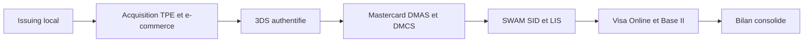
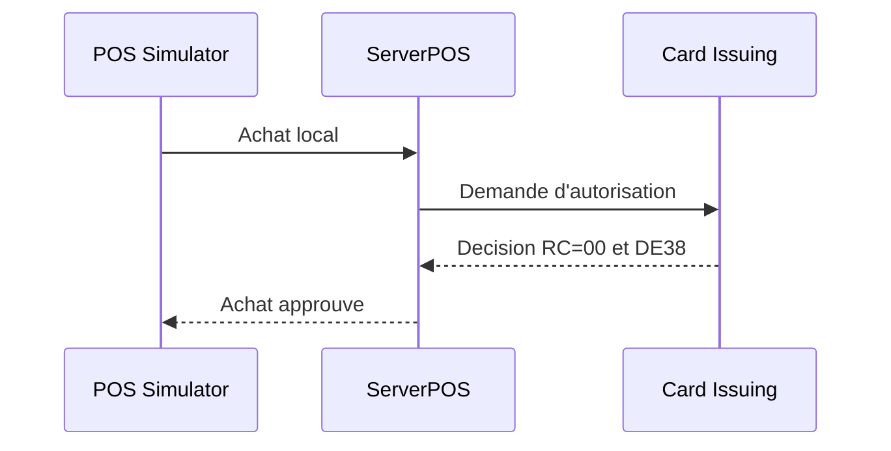
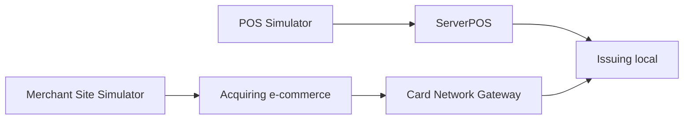
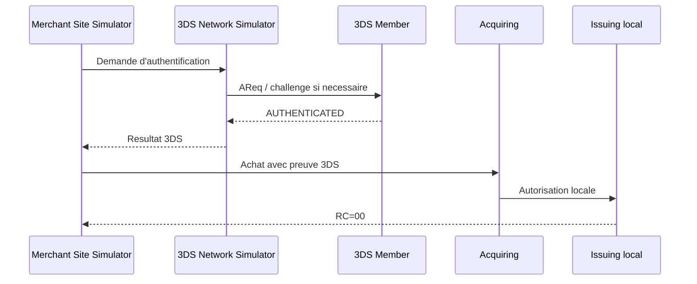
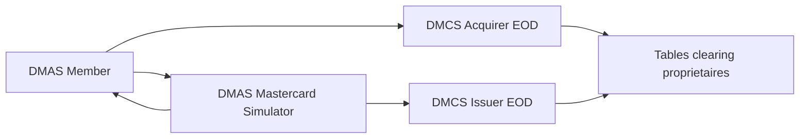
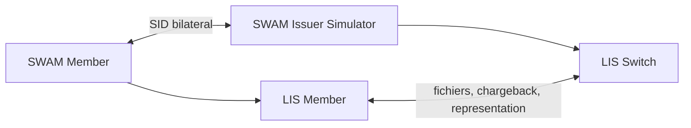
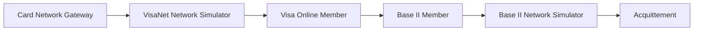

# Campagne globale d'integration de la plateforme

## Objectif

Cette campagne prouve, avec un point d'entree Git Bash unique, que les six
domaines peuvent etre executes successivement sur la meme machine sans
reutiliser un processus ou un resultat d'un domaine precedent.

Elle couvre l'autorisation, l'authentification e-commerce et les premiers
circuits de clearing disponibles. Elle ne remplace pas une certification avec
un reseau reel, un HSM de production ou les vecteurs officiels de RECETTE.

## Vue globale



Les domaines sont volontairement sequentiels. Chaque domaine demarre ses
services, provisionne ses donnees, execute ses controles et arrete uniquement
les PID qu'il a crees avant de rendre les ports au domaine suivant.

## Les six etapes operateur

`run-all.sh` orchestre les scripts numerotes. La consultation des journaux est
interactive et reste facultative.

| Etape | Script | Resultat attendu |
|---|---|---|
| 1 | `00-check-prerequisites.sh` | outils, fichiers et variables obligatoires presents |
| 2 | `01-build.sh` | modules compiles et tests Maven reussis |
| 3 | `02-start.sh` | services du domaine joignables |
| 4 | `03-bootstrap-and-provision.sh` | schemas, cartes, contrats et cles de test prets |
| 5 | `04-run-tests.sh` | transactions et clearing executes |
| 6 | `05-check-results.sh` | preuves fonctionnelles acceptees |

`07-stop.sh` est toujours appele en fin de parcours, y compris apres un echec.
`06-tail-logs.sh` sert uniquement a l'analyse interactive.

## Scenarios executes

### 1. Issuing local



Preuves : services UP, carte/contrat BANK1 provisionnes, route locale active,
achat approuve avec `RC=00`.

### 2. Acquisition TPE et e-commerce



Preuves : un achat TPE puis un achat e-commerce sont approuves avec `RC=00`.
Le parcours e-commerce local annonce la route `LOCAL_ISSUING` et
`3DS=NOT_PERFORMED` dans ce scenario non authentifie.

### 3. E-commerce authentifie 3DS



Preuves : frictionless national, challenge national et challenge
international tous `AUTHENTICATED`, autorises avec `RC=00`, avec controle
anti-rejeu.

### 4. Mastercard DMAS et clearing DMCS



Preuves : sign-on et echange PEK, achat PIN, absence de DE52 dans le clearing,
advice, reversal idempotent, validation ARQC, retour ARPC en tag 91, EOD DMCS
des deux proprietaires et second EOD sans doublon.

### 5. SWAM SID et clearing LIS



Preuves : KCV des cles de session concordants, cinq achats approuves dans
chaque sens, liaison SID unique, EOD et fichiers LIS integres, chargebacks et
representation, ecritures membre et switch equilibrees. Le harnais produit
`PASSED (30 controles)`.

### 6. Visa Online et Base II



Preuves : autorisation Online `RC=00`, rejeu idempotent, fichier Base II de
cinq records et acquittement reseau accepte.

## Configuration et lancement

Preparer le fichier local ignore par Git :

```bash
mkdir -p runtime/platform-e2e
cp tests/platform-e2e/platform-e2e.env.example \
  runtime/platform-e2e/platform-e2e.env
```

Renseigner la copie locale avec les seules valeurs de LAB/RECETTE autorisees,
puis lancer depuis la racine du depot :

```bash
bash tests/platform-e2e/global/run-all.sh
```

Le premier lancement conserve le build et les tests Maven. Apres validation
des JAR, une reexecution fonctionnelle plus rapide est possible :

```bash
PLATFORM_E2E_SKIP_BUILD=true \
  bash tests/platform-e2e/global/run-all.sh
```

Pour limiter temporairement une campagne :

```bash
PLATFORM_E2E_MODULES="acquiring three-ds visa" \
  bash tests/platform-e2e/global/run-all.sh
```

Pour produire un bilan de tous les domaines sans s'arreter au premier echec :

```bash
PLATFORM_E2E_CONTINUE_ON_FAILURE=true \
  bash tests/platform-e2e/global/run-all.sh
```

## Resultats et diagnostic

- bilan : `runtime/platform-e2e/global/summary.tsv` ;
- sortie par domaine : `runtime/platform-e2e/global/<domaine>.log` ;
- erreurs par domaine : `runtime/platform-e2e/global/<domaine>.err.log` ;
- etapes horodatees : `runtime/platform-e2e/<domaine>/status.tsv` ;
- preuves metier : `runtime/platform-e2e/<domaine>/test-output.log` lorsque le
  domaine en produit un.

La campagne est acceptee uniquement lorsque les six lignes du bilan sont
`PASSED` et que les services lances ont ete arretes.

## Execution de reference du 2 aout 2026

Commande :

```bash
PLATFORM_E2E_SKIP_BUILD=true \
  bash tests/platform-e2e/global/run-all.sh
```

Resultat en 694,9 secondes :

```text
issuing                 PASSED
acquiring               PASSED
three-ds                PASSED
mastercard-dmas-dmcs    PASSED
swam                    PASSED
visa                    PASSED
```

## Limites explicites

- aucun vecteur PIN/ARQC WayPos reel n'est invente ;
- DE31/ARN DMCS reel, settlement et litiges bilateraux restent hors scope ;
- le MAC SWAM avec le switch reel n'est pas assimile au sandbox local ;
- le sandbox Visa actuel ne revendique ni transport/HSM certifie, ni VROL, ni
  clearing Visa complet ;
- les cles claires, PIN, PAN complets et mots de passe ne sont jamais ajoutes
  aux fichiers versionnes.
