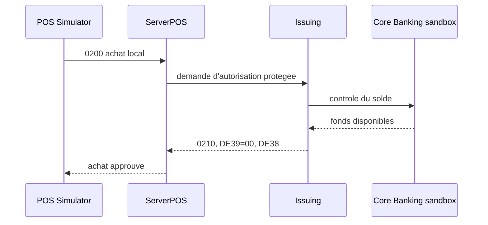

# Test E2E Issuing local

## Objectif et resultat attendu

Ce parcours cree la configuration fonctionnelle, demarre Issuing, ServerPOS et
le simulateur TPE, puis realise un achat local. Le resultat attendu est une
decision Issuing `APPROVED` avec `DE39=00` et un code d'autorisation `DE38`.



## Configuration de test

Copier `../platform-e2e.env.example` vers
`runtime/platform-e2e/platform-e2e.env`, puis renseigner la copie locale. Les
variables obligatoires sont les mots de passe PostgreSQL/Issuing/WayPos, le
LMK WayPos, le PAN sandbox, l'expiration, le pepper, la cle d'outbox et les
cles WayPos de LAB.

Les valeurs claires ne sont pas versionnees. Pour les cles maitres TPE de
test deja approuvees, les controles attendus sont :

| Cle | Format | KCV attendu |
|---|---|---|
| TAMK | 24 octets, 48 hex | `51C71D` |
| TPMK | 24 octets, 48 hex | `95B446` |

La TAK initiale doit correspondre au profil provisionne des deux cotes. Elle
ne doit pas etre inventee. Les vecteurs ARQC de recette ne sont pas requis par
ce test d'achat magstripe sandbox ; le parcours financier EMV reel reste un
test separe tant que ses quatre vecteurs ne sont pas disponibles.

## Execution

```bash
bash tests/platform-e2e/issuing/run-all.sh
```

Le pas-a-pas utilise les scripts `00` a `05`. `06-tail-logs.sh` suit les logs
et `07-stop.sh` arrete seulement les PID du parcours.

## Preuves et limites

La reponse est conservee hors Git dans
`runtime/acquiring-pos-e2e/pos-purchase-response.json`. Le test ne valide pas
un HSM PayShield reel, un PIN de recette, ni les quatre ARQC/ATC distincts.
