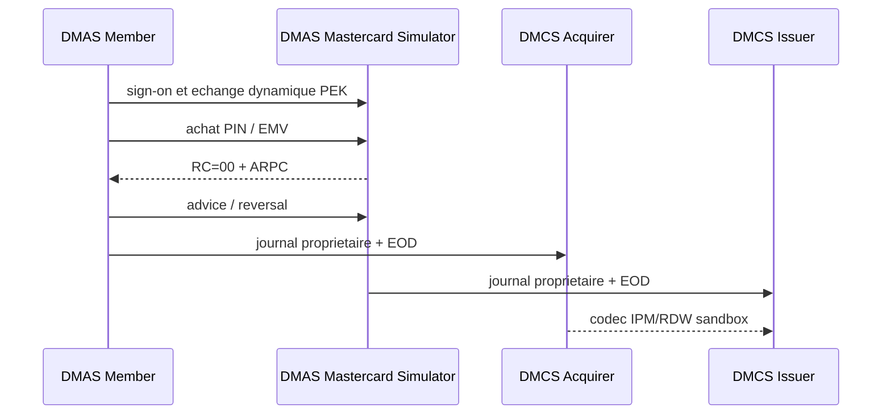

# Test E2E Mastercard DMAS et DMCS

## Objectif

Le meme guide couvre l'autorisation temps reel DMAS et la preparation du
clearing DMCS afin de conserver le lien entre transaction et fin de journee.



## Configuration locale

Les variables `DMAS_ADMIN_PASSWORD`, `DMAS_KEK_CLEAR`, `DMAS_MDK_CLEAR` et
`DMAS_TEST_PIN` sont obligatoires. Elles doivent contenir uniquement des
valeurs synthetiques LAB/RECETTE et rester dans
`runtime/platform-e2e/platform-e2e.env`, ignore par Git. Les KCV recalcules par
les composants doivent concorder avant activation ; le guide ne publie pas de
cle claire.

## Execution

```bash
bash tests/platform-e2e/mastercard-dmas-dmcs/run-all.sh
```

Le parcours installe la base, compile et teste, demarre membre et simulateur,
realise le bootstrap, teste PIN, advice/reversal et ARQC/ARPC, puis execute les
deux EOD DMCS. `06-tail-logs.sh` suit les journaux de
`runtime/dmas-dmc/logs/`.

## Limites explicites

Le codec IPM/RDW sandbox est teste. La construction d'un First Presentment
reel reste bloquee tant que DE31/ARN et sa regle officielle ne sont pas
approuves. Settlement, reconciliation complete et litiges bilateraux ne sont
donc pas marques comme valides par ce parcours.
