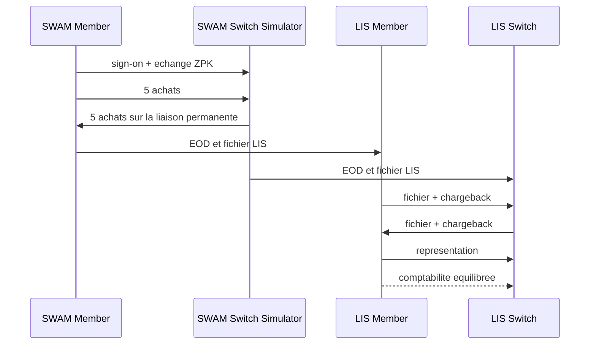

# Test E2E SWAM SID et clearing LIS

## Objectif

Valider l'autorisation bidirectionnelle entre membre et switch, puis le cycle
LIS comprenant EOD, fichiers, chargeback, representation et comptabilite.



## Configuration et execution

Le fichier local ignore doit contenir `DB_PASSWORD` et
`SWAM_E2E_KEK_CLEAR`. La KEK doit etre synthetique, reservee au test et ne
doit jamais etre journalisee.

```bash
bash tests/platform-e2e/swam/run-all.sh
```

Le resultat attendu est `RESULTAT : PASSED`, avec autorisations approuvees,
liaison unique bidirectionnelle, fichiers LIS integres, chargebacks recus,
representation et ecritures equilibrees. Ce sandbox ne prouve pas la
compatibilite MAC avec le switch SWAM reel ; l'incident MAC de recette reste
un sujet de raccordement distinct.
