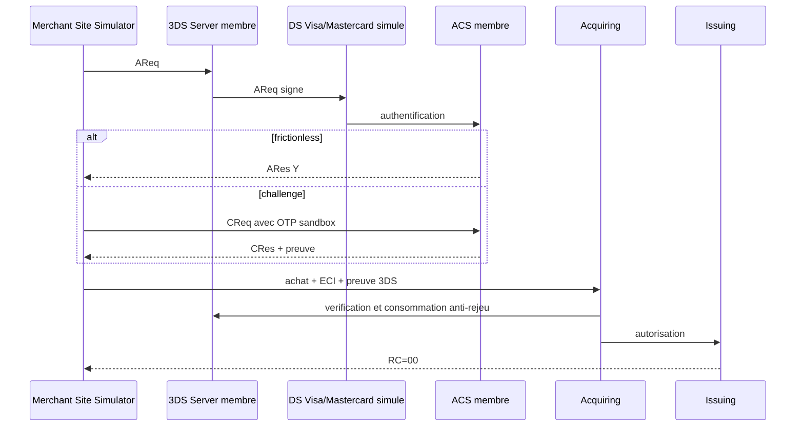

# Test E2E 3DS et achat authentifie

## Objectif

Ce parcours sandbox valide les trois cas 3DS deja implementes, suivis d'une
autorisation locale reelle dans le moteur Issuing.



## Configuration

Dans `runtime/platform-e2e/platform-e2e.env`, definir deux secrets HMAC
sandbox d'au moins 32 caracteres et un OTP sandbox :

```dotenv
THREE_DS_SANDBOX_HMAC_KEY=
THREE_DS_NETWORK_SANDBOX_HMAC_KEY=
THREE_DS_SANDBOX_CHALLENGE_OTP=
THREE_DS_PROGRAM=MASTERCARD
```

Ce sont des secrets locaux de test, jamais des cles de production.

## Execution et criteres

```bash
bash tests/platform-e2e/three-ds/run-all.sh
```

Les trois achats attendus sont : national frictionless, national challenge et
international challenge. Chacun doit produire `RC=00` et
`authenticationStatus=AUTHENTICATED`. Le DS est fonctionnel mais non certifie
EMVCo/Visa/Mastercard ; une carte Visa off-us reste hors de ce parcours tant
que son moteur financier reel n'est pas raccorde.
