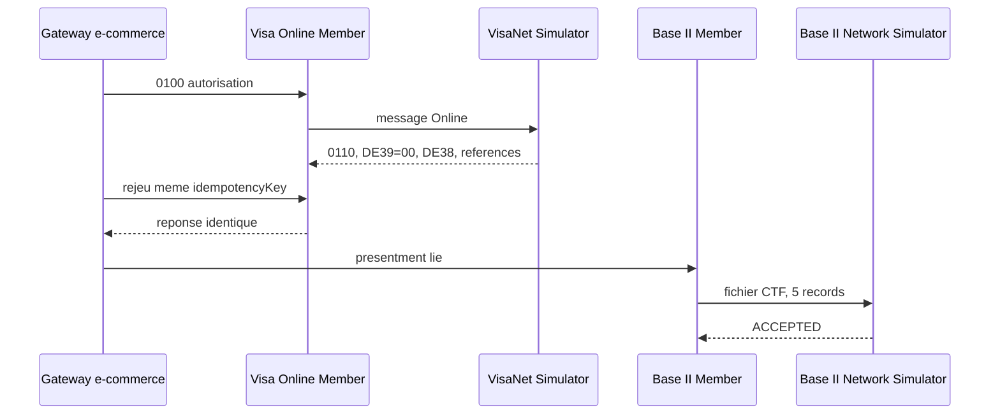

# Test E2E Visa Online et Base II

## Objectif

Valider le premier circuit Visa off-us : autorisation Online, rejeu
idempotent, presentment Base II et acquittement reseau simule.



## Execution

```bash
bash tests/platform-e2e/visa/run-all.sh
```

Aucun secret ni mot de passe n'est requis par ce sandbox autonome. La carte
publique de test reste contenue dans le harnais Visa historique et ne doit pas
etre remplacee par un PAN reel.

Le resultat attendu est une autorisation `APPROVED/00`, une reponse de rejeu
identique, puis un presentment `ACCEPTED` de cinq records. Les preuves sont
sous `runtime/visa-e2e/results/`.

Le transport Visa certifie, VSS/TC46, Edit Package, VROL, chargeback et
pre-arbitrage demeurent fermes tant que les specifications officielles
correspondantes ne sont pas disponibles.
