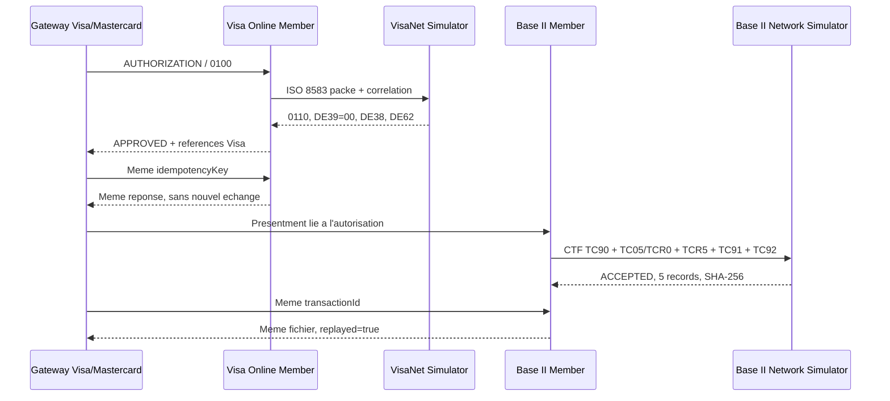

# Manuel de test Visa Online et Base II

## Objectif

Ce test valide le premier circuit Visa off-us de la plateforme : autorisation
Visa Online, rejeu idempotent, preparation d'un presentment Base II TC05 puis
acquittement par un reseau Base II simule.

Il s'agit d'une sandbox fonctionnelle non certifiee. Le script n'etablit
aucune connexion avec Visa et n'utilise ni secret, ni carte, ni vecteur de
recette reel. Le PAN `4111111111111111` est exclusivement une valeur publique
de test et ne doit jamais etre remplacee par un PAN reel dans ce harnais.

## Modules couverts

| Port | Module | Responsabilite |
|---:|---|---|
| 8563 | `sg-visa-mastercard-gateway-simulator` | Multiplexage et routage par programme |
| 8564 | `sg-visa-online-member` | Construction ISO 8583, correlation et journal masque |
| 8565 | `sg-visa-visanet-simulator` | Reponse VisaNet simulee et references DE62 |
| 8566 | `sg-visa-base2-member` | ARN et fichier CTF 168 octets |
| 8567 | `sg-visa-base2-network-simulator` | Validation, deduplication et acquittement |

Les deux modules communs `sg-visa-common` et `sg-visa-base2-common` sont des
bibliotheques invisibles. Ils ne sont pas deployes comme services.

## Schema du test



## Prerequis

- Git Bash ;
- Java 21 ou plus. Le script utilise par defaut le JBR 25 livre avec IntelliJ
  sous `D:/MoneyCore/idea-2026.1.3.win/jbr/bin/java.exe` ;
- le Maven embarque et le cache local definis dans `AGENTS.md` ;
- les ports 8563 a 8567 libres ;
- Python et `curl` accessibles depuis Git Bash.

Aucun mot de passe de base, cle cryptographique ou variable `.env` sensible
n'est requis pour ce test autonome.

## Execution Git Bash

Depuis la racine du depot :

```bash
bash ./tests/visa/e2e/run-visa-online-base2.sh
```

Pour reutiliser des JAR deja construits :

```bash
VISA_E2E_SKIP_BUILD=true bash ./tests/visa/e2e/run-visa-online-base2.sh
```

Le script refuse de reutiliser un processus inconnu qui occuperait un port.
Il arrete uniquement les processus qu'il a lui-meme demarres.

## Resultat attendu

La fin de l'execution doit contenir :

```text
[VISA E2E] UP - visanet-network
[VISA E2E] UP - visa-online-member
[VISA E2E] UP - card-network-gateway
[VISA E2E] UP - base2-network
[VISA E2E] UP - base2-member
[VISA E2E] OK - autorisation Visa Online, rejeu idempotent, fichier Base II (5 records) et acquittement reseau valides.
```

Les preuves JSON se trouvent dans `runtime/visa-e2e/results/` et les journaux
dans `runtime/visa-e2e/logs/`. Ces repertoires de runtime restent hors Git.

Pour suivre les journaux pendant un lancement conserve manuellement :

```bash
bash ./tests/visa/e2e/tail-logs.sh
```

## Controles realises automatiquement

- reponse d'autorisation `APPROVED` avec `networkResponseCode=00` ;
- presence de DE38 et des references Visa DE62 ;
- egalite exacte de la reponse lors du rejeu Online ;
- acceptation du fichier Base II ;
- fichier compose de 5 records fixes de 168 octets ;
- ARN de 23 chiffres avec chiffre de controle ;
- deduplication Base II avec `replayed=true` ;
- acquittement visible dans le simulateur reseau.

## Non-regression de reference du 2 aout 2026

- backend : 83 tests Maven, 0 echec ;
- frontend : build Angular reussi ;
- Playwright : 7 reussis, 3 historiques ignores, 0 echec ;
- packaging : 27 modules Maven construits, dont les deux bundles, 0 echec ;
- E2E : autorisation, rejeu, Base II et acquittement reussis ;
- verification de securite : aucun PAN complet trouve dans les logs E2E ;
- aucun service Visa encore actif apres le test.

## Limites et suite

Le codec couvre le corps ISO utile au sandbox ; l'en-tete et le transport Visa
reels restent un port separe a raccorder avec les parametres officiels. Le
journal du premier increment est en memoire. Le clearing certifie complet,
VSS/TC46, Edit Package, VROL, chargeback et pre-arbitrage restent fermes tant
que les specifications et codes Visa officiels correspondants ne sont pas
disponibles. Aucune valeur fictive ne doit contourner ces absences.
